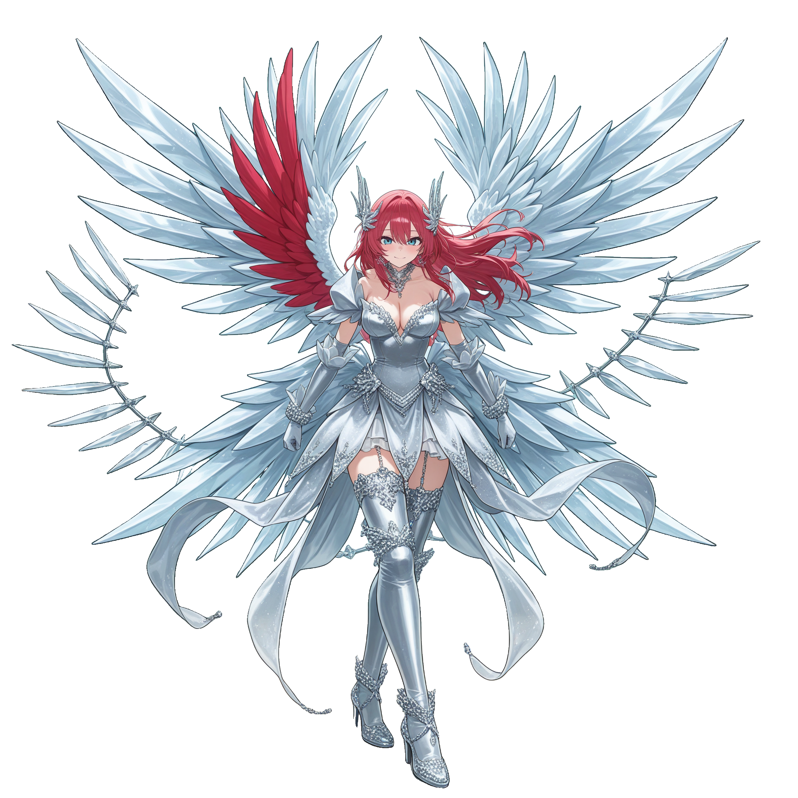
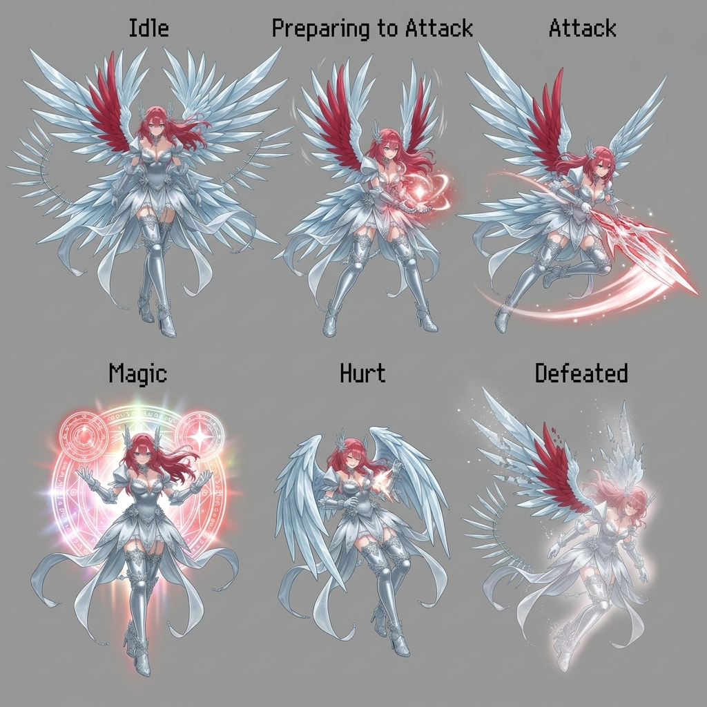

# Character Concept: Althea — The Living Echo

## 👤 Profile
- **Full Name**: Althea (The Collective Soul of the Ebon Light)
- **Title**: The Saint of What Could Have Been / The Luminous Echo
- **Gender**: Female (Ethereal Manifestation)
- **Origin**: The Eternal Void (Born from 600 years of displaced hope)
- **Role**: Late-Game Guide / Narrative Catalyst / Fusion Component
- **Aesthetic**: Silver-white celestial armor, pink hair, six crystalline wings with red-starlight accents. She appears translucent, as if made of pure memory.

## ✨ The Nature of her Existence
Althea is not a person in the traditional sense. She is the **Metaphysical Weight** of all the light that Valdris ripped from Morgana's bloodline.
- Whenever an Ebon Knight touched a sword and it turned dark, the light that *should* have filled that blade manifested in the Void. 
- Althea is the sum of every act of heroism, every smile, and every "Pure Blade" that was denied to Morgana's family for 600 years.

## 📖 Lore: The Ghost in the Stars
For centuries, Althea has been a silent observer in the **Eternal Void**. She felt the death of every ancestor of Morgana. She felt the moment Morgana was born—the brightest spark of potential the family had seen in generations.

She cannot interact with the physical world directly. She can only send "Echoes" (Luminous Feathers) to those whose blood resonates with her own. She waits at the edge of Valdris's sanctum, hoping for the day the "True Heir" will come to reclaim what was stolen.

## 🗺️ Story Integration: The Rebirth Quest

### **The Vision of the Star (Arc 7)**
After Morgana joins the party, the player finds **Luminous Feathers** in secret areas of the Fortress. 
- **Trigger**: Only Morgana can pick them up. Each feather triggers a short "Memory Fragment" showing a world where the Ebon line was never cursed.

### **The Final Union (Arc 8 Climax)**
Found within the **Crystalline Pillar** at the heart of the Void.
- **The Choice**: Morgana must choose to merge her soul with Althea.
- **The Result**: Breaks the "Obsidian Pulse" curse. Morgana transforms into her **"Aethelgard Ascendant"** form, capable of dealing both Void and Light damage.

## 🕊️ Interaction Flow
- **The Voice**: Before she is found, Althea speaks to Morgana during rest periods, acting as a "Guardian Angel" figure.
- **The Gift**: She provides the party with "Starlight Shards" which can be used to temporarily purify corrupted equipment.
