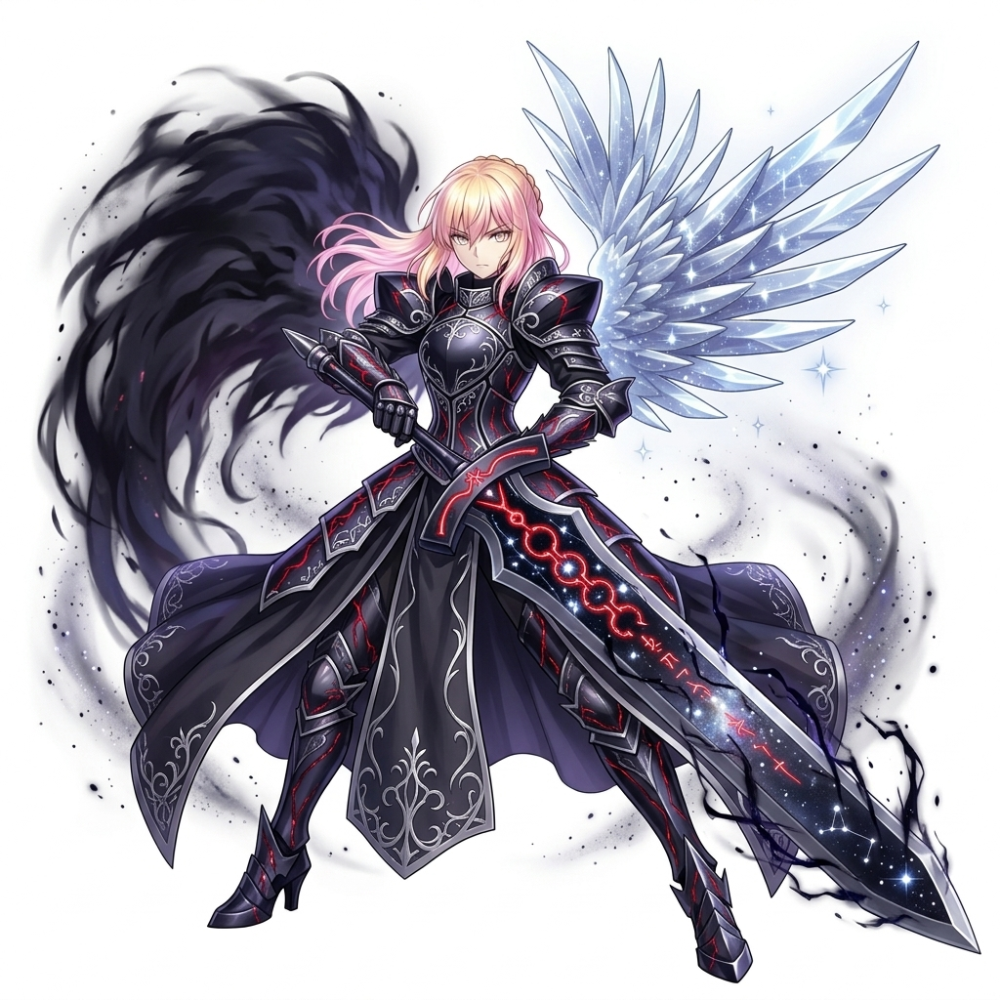
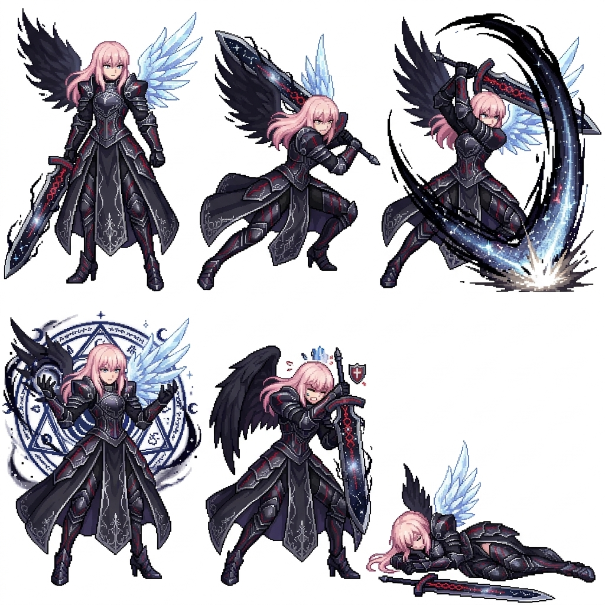
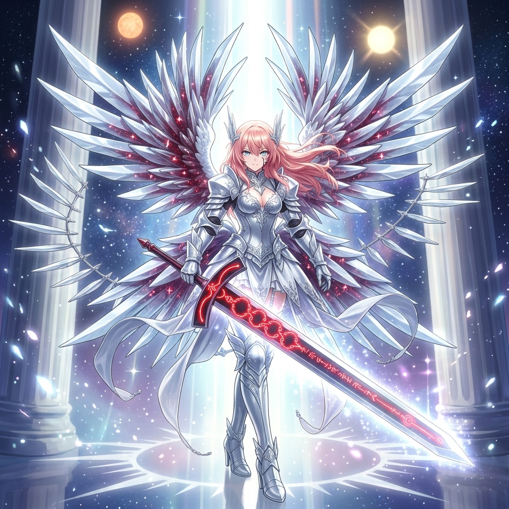
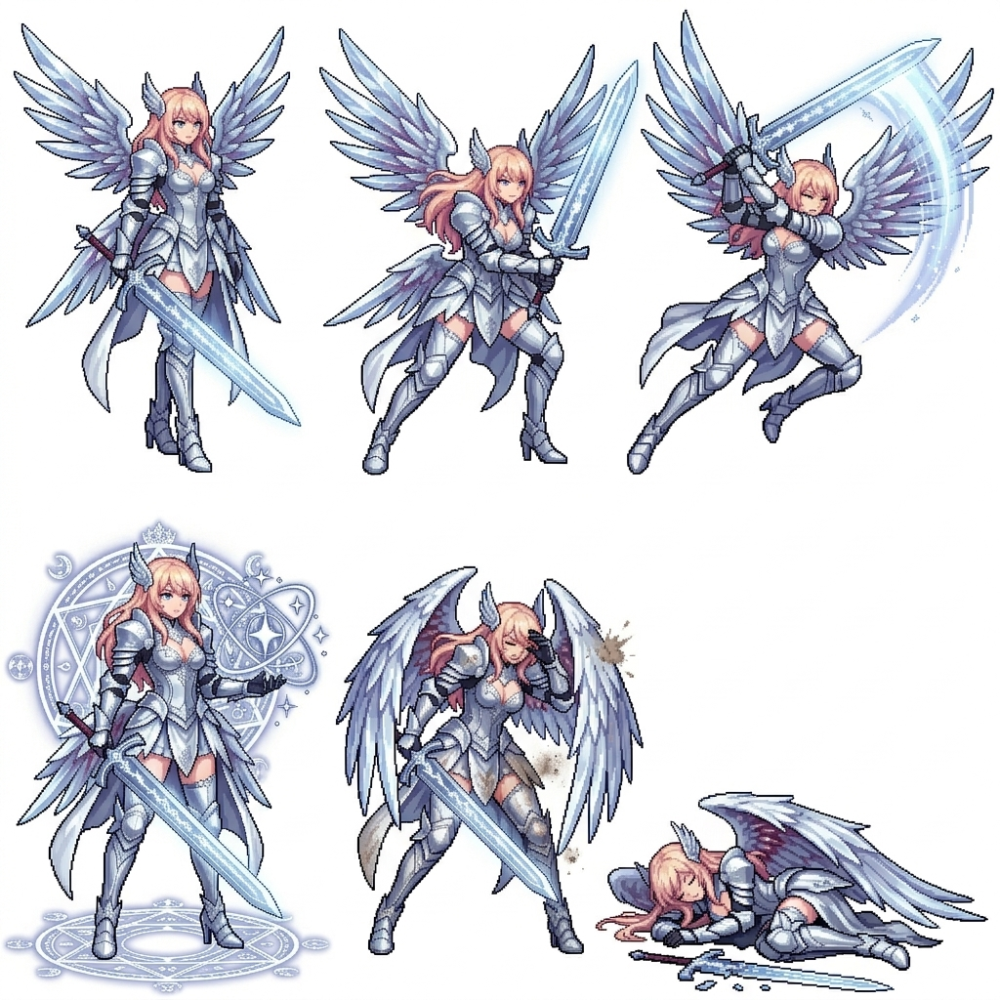

# Character Concept: Morgana Ascendant (The Valkyrie of Eclipse & Solstice)

This profile covers the final fused form of Morgana and Althea, acting as the Ultimate Ascension for the Dark Valkyrie.

## Form 1: Eclipse Stance (Void Dominant)

- **Aesthetic**: A powerful fusion where Morgana's dark valkyrie armor incorporates Althea's celestial motifs. She wears obsidian plate adorned with silver-white filigree and glowing red 'Veins of the Void'. She features an asymmetrical appearance with a glowing crystalline wing on one side and a dark aura on the other.
- **Combat Focus**: High Damage, Void/Shadow elemental strikes.

## Form 2: Solstice Stance (Light Dominant)

- **Aesthetic**: The fully purified manifestation. Her heavy armor transforms into radiant silver-white celestial plate. She possesses six majestic crystalline wings and flowing pink-blonde hair. The Ebon Greatsword is fully purified into a massive blade of pure starlight.
- **Combat Focus**: Party support, healing, Light/Celestial elemental shielding.
