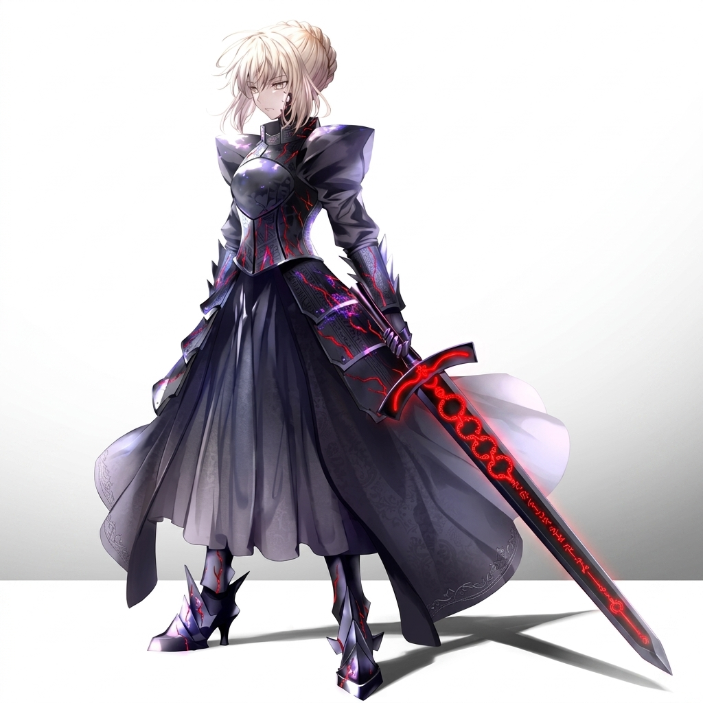

# Character Concept: Morgana — The Dark Valkyrie

## 👤 Profile
- **Full Name**: Morgana of the Ebon Line
- **Title**: The Dark Valkyrie / Heiress of the Cursed Steel
- **Gender**: Female
- **Origin**: The Shadow Reach (Ancient Guardian Bloodline)
- **Role**: Playable Ally (Unlockable) / Boss (First Encounter)
- **Aesthetic**: Blonde hair, heavy obsidian plate armor with red glowing "Veins of the Void," wielding the Cursed Ebon Greatsword.

## 🩸 The Curse: Obsidian Pulse
Morgana's blood carries the residue of the first Shattering. Any physical weapon she touches is instantly corrupted by void energy, turning it into a **Dark Blade**. 
- **Effect**: The weapon deals massive Shadow/Void damage but slowly drains the wielder's HP.
- **Narrative**: She wears heavy armor to prevent herself from accidentally touching the world around her, living as a self-imposed exile.

## 📖 Lore: The Last Stand of the Ebon Line
For 600 years, the descendants of the **Ebon Champion** lived as pariahs. Cursed by Valdris to consume everything they touch, they were forced into the lightless fringes of the world. Morgana, the youngest heiress, refused to watch her lineage dissolve into the void.

Equipped with the last heirloom of her house, she launched a suicidal solo invasion of Valdris's fortress. She breached the Outer Gates by sheer force of will, but her journey ended in the **Hall of Cursed Steel**. She sought the "Primal Forge" to break her curse, but found only a graveyard of failed heroes. Now, her life force is nearly spent, and she remains in the hall as a tragic sentinel—guarding the path not for Valdris, but to prevent other "fools" from meeting her fate.

### **The Star in the Dark**
Deep within her mind, Morgana hears a faint, melodic echo—the voice of **Althea**, the manifestation of her family's lost light. This "Spirit of What Could Have Been" is the only thing keeping Morgana's heart from being fully consumed by the Obsidian Pulse.

## 🗺️ Story Integration: Where to meet her?

### **Arc 6, Chapter 3: The Hall of Cursed Steel (Outer Fortress)**
The party discovers Morgana kneeling amidst a sea of shattered, obsidian-stained blades. She is the "Unbroken Failure."

1. **The Encounter**: She warns the party to turn back, claiming that the "Obsidian Pulse" will consume them just as it has her.
2. **The Boss Fight (The Duel of Despair)**: She fights with the frantic strength of someone who has nothing left to lose.
3. **The Turning Point**: When the party's Elemental Resonance resonates with her Ebon Blade, she realizes they carry the light she thought was extinct.
4. **The Recruitment**: She joins the party, but with a warning: "I will cut the path to Valdris, but do not touch my hand. I am already half-shadow."

## ⚔️ Combat Style: Dark Knight
- **Passive: Blood Price**: Every 3rd attack deals 2x damage but costs 5% of her Max HP.
- **Skill: Void Rend**: A massive horizontal sweep with her Dark Blade that leaves a "shadow trail" dealing damage over time.
- **Ultimate: Ebon Awakening**: She fully embraces the curse for 3 turns, becoming invulnerable but losing 10% HP per turn.
