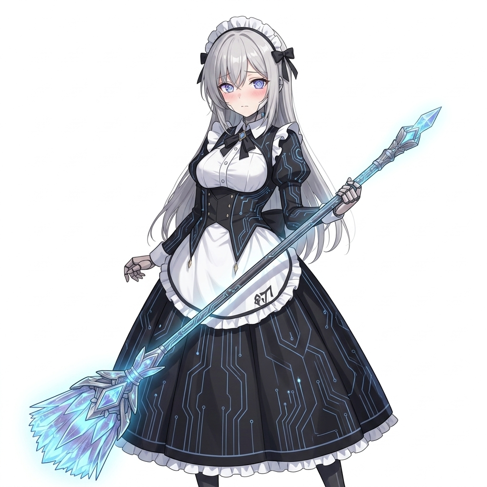
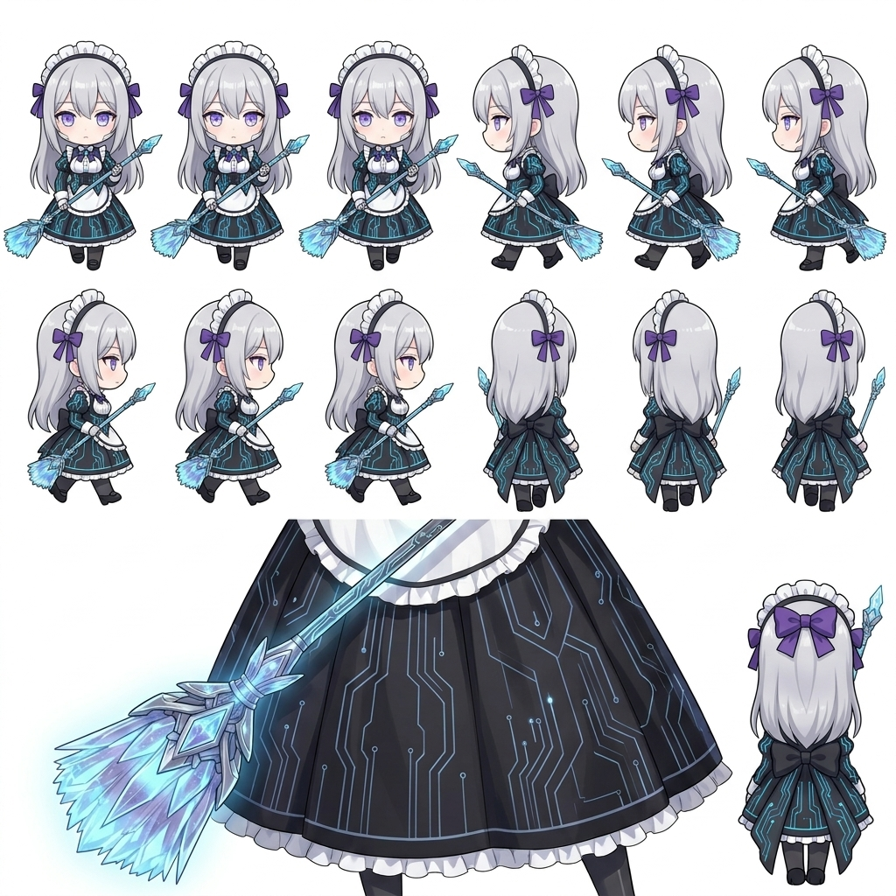
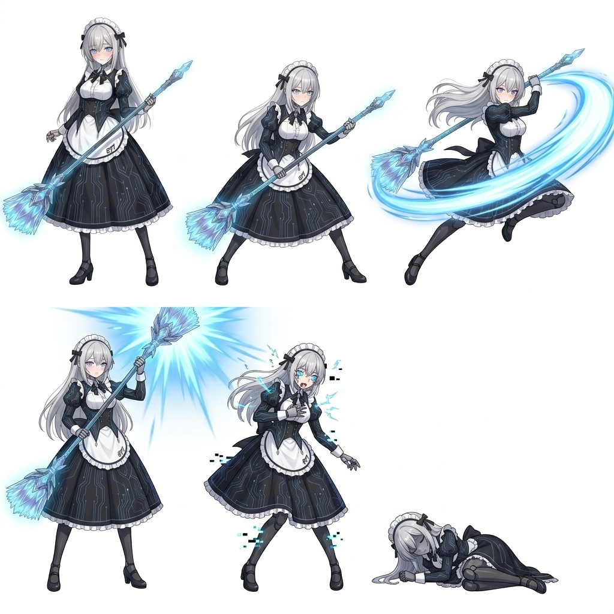

# Character Concept: MINA-01 — The Aether-Automaton

## 👤 Profile
- **Model Name**: MINA-01 (Maintenance & Interception Neural Automaton)
- **Common Name**: Mina
- **Type**: **Aether-Automaton** (NPC / Guide)
- **Origin**: Aethoria — The Forge Lords (Built for Aethelgard Royalty)
- **Aesthetic**: Silver hair, professional gothic maid uniform with glowing blue aether-circuits, subtle mechanical joint seams, robotic eyes, carrying a glowing aether-broom.

## 🤖 Automaton Specs

### **Role: Castle Caretaker (NPC)**
Mina acts as the primary NPC for the **Ice Castle (F3 Expansion)**. She provides the party with "Old World" lore and helps navigate the castle's thawing mechanics.

### **Core Directives**
1. **Cleanse**: Remove all foreign "Void Dust" from the Royal Sanctum.
2. **Preserve**: Ensure the Royal Heirs (Selene/Aya) remain in optimal condition.
3. **Wait**: Do not leave the post until the temperature exceeds 0°C (The Thaw).

### **Potential Combat Support (Ally NPC)**
If she accompanies the party as a guest NPC, her abilities focus on **System Maintenance**:
- **Protocol: Dust Sweep**: Clears all area-of-effect hazards (fire, poison, etc.) from the battle floor.
- **Protocol: Polished Shield**: Grants one ally +50% Physical DEF for 1 turn by coating their armor in slick ice.

## 📖 Lore
Built by the Forge Lords as a gift to the Ash Kingdom 600 years ago, Mina is one of the few surviving Aether-Automatons. While her organic counterparts fell to the Void, her logic-driven mind allowed her to ignore Valdris's seduction. She stayed awake through the entire 600-year freeze, meticulously dusting a castle that no one inhabited.

She is "Glitched" by time; she occasionally speaks in serial numbers and is terrified of the party's "chaotic biological signatures" (i.e., tracking mud into her lobby).

## 🗺️ Interaction Flow
1. **First Meeting**: Found frantically trying to mop up the melting ice in the **Ice Castle Lobby** after the Demon Lord's defeat.
2. **The Guide**: She explains the layout of the castle and the location of Princess Selene.
3. **The Shop**: She runs a specialized "Old World Salvage" shop, accepting ancient coins found in the Crystal Caverns.
