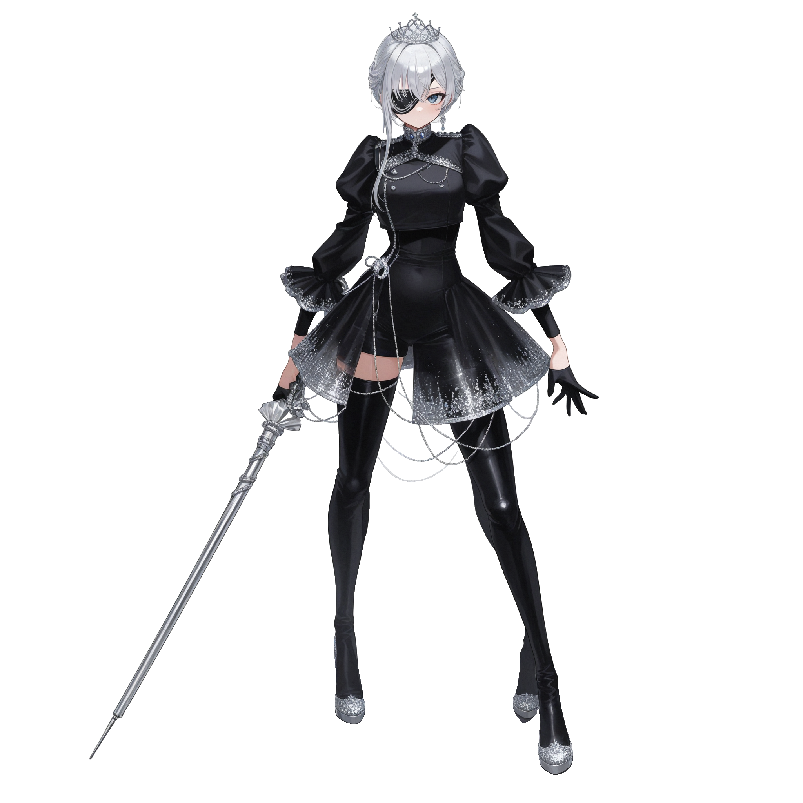
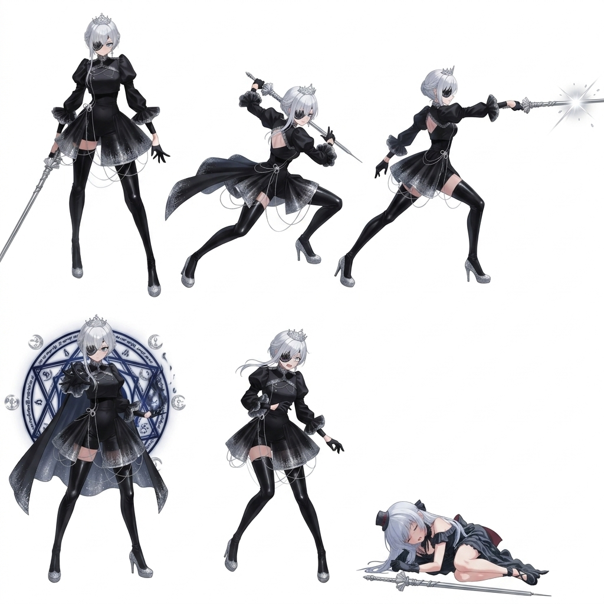
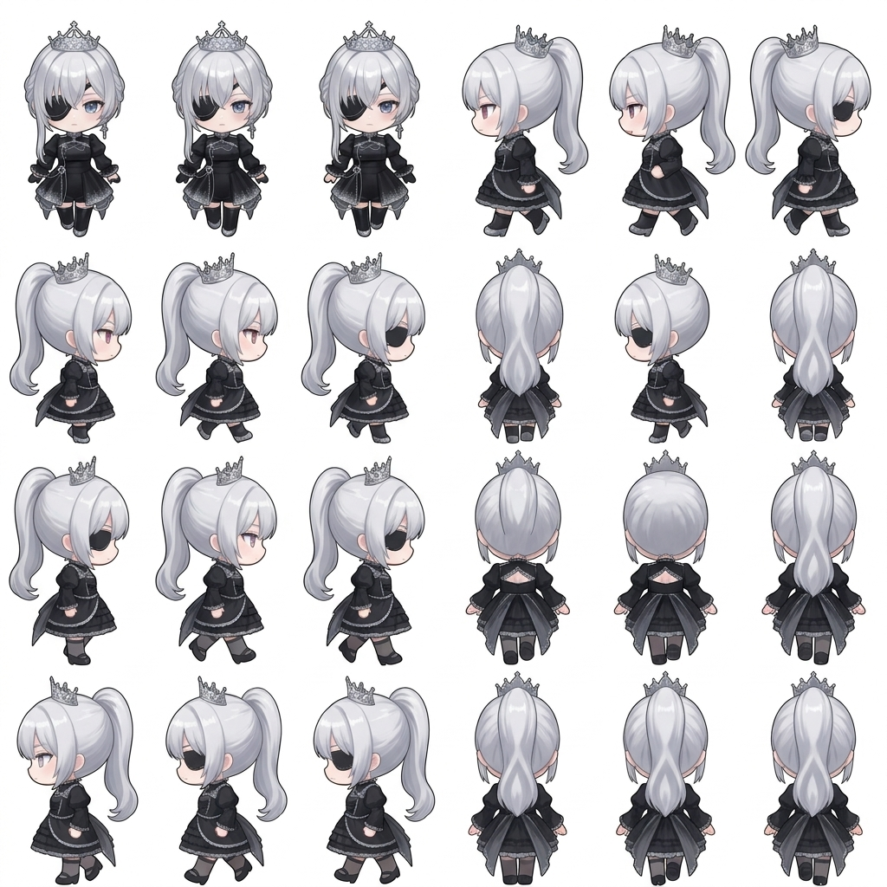

# Character Concept: Selene — The Obsidian Heir

## 👤 Profile
- **Full Name**: Selene Aethelgard
- **Title**: The Obsidian Heir / The Last Princess of the Ash Kingdom
- **Age**: 19 (Chronologically 619 due to stasis)
- **Origin**: Aethoria — Aethelgard (The Ice Castle, Crystal Cavern F3)
- **Archetype**: **Obsidian Fencer** (High Speed / Precision Duelist)
- **Aesthetic**: Silver hair, black eye-patch, gothic royal dress, silver tiara, Obsidian Estoc.

## ⚔️ Gameplay Kit

### **Passive: Crystalline Precision**
Attacks apply **Frost Marks**. At 3 stacks, the target's armor "shatters."
- **Effect**: Reduces target DEF by 15% and increases Physical Damage taken by 15% for 2 turns.

### **Base Stats (Target)**
- **HP**: 78
- **MP**: 24
- **ATK**: 21
- **DEF**: 15
- **SPD**: 19
- **MAG**: 10
- **LCK**: 12

### **Suggested Abilities**
1. **Lunge of the Lost**: A quick pierce that deals bonus damage if Selene acted first this turn.
2. **Royal Parry**: Enter a counter-stance for 1 turn. If hit by a physical attack, Selene dodges and performs a guaranteed CRIT counter.
3. **Obsidian Rain (Ultimate)**: A flurry of strikes that immediately detonates all Frost Marks on all enemies.

## 📖 Lore
She woke from six centuries of stasis to find her kingdom a tomb of ice. She does not seek to rebuild what is lost, only to ensure that the man who broke it pays the ultimate toll. She wears her family's eyepatch as a reminder of the night the Light Seal fractured and the world went grey.

## 🗺️ Recruitment Flow
1. **Condition**: Defeat the **Demon Lord (Solvan)** in the Crystal Cavern Core.
2. **Event**: The Ice Castle gates in the North melt.
3. **Dialogue**: Selene is found in the Royal Sanctum. She challenges the party to a duel to ensure they aren't "hollowed" or corrupted by the Void.
4. **Join**: After her HP reaches 30%, the duel ends, and she joins the party to reclaim her heritage.
