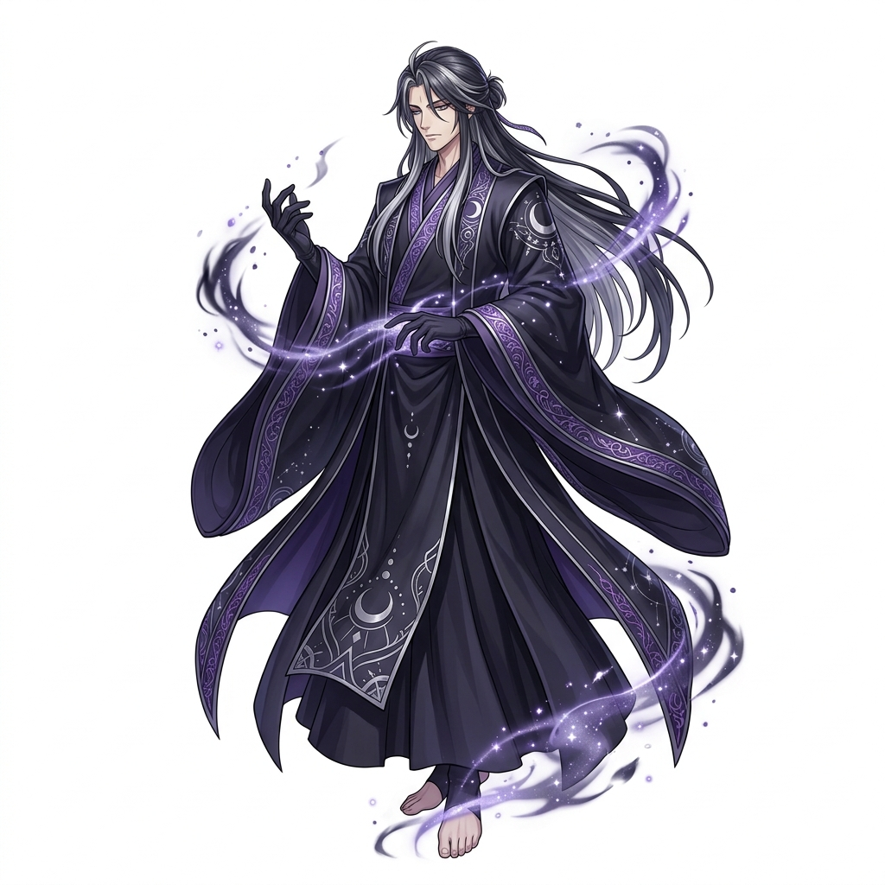
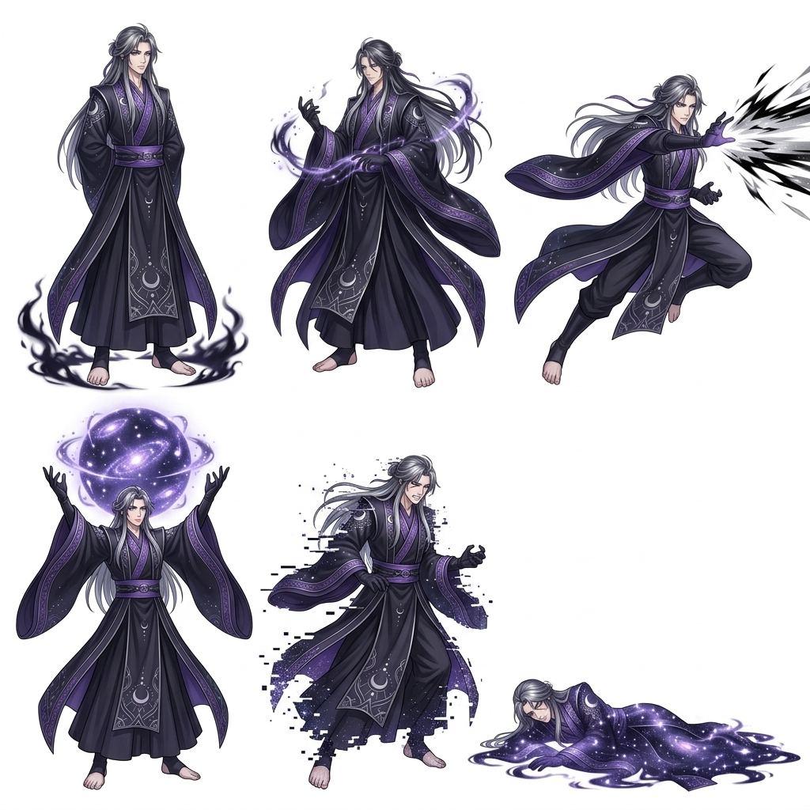
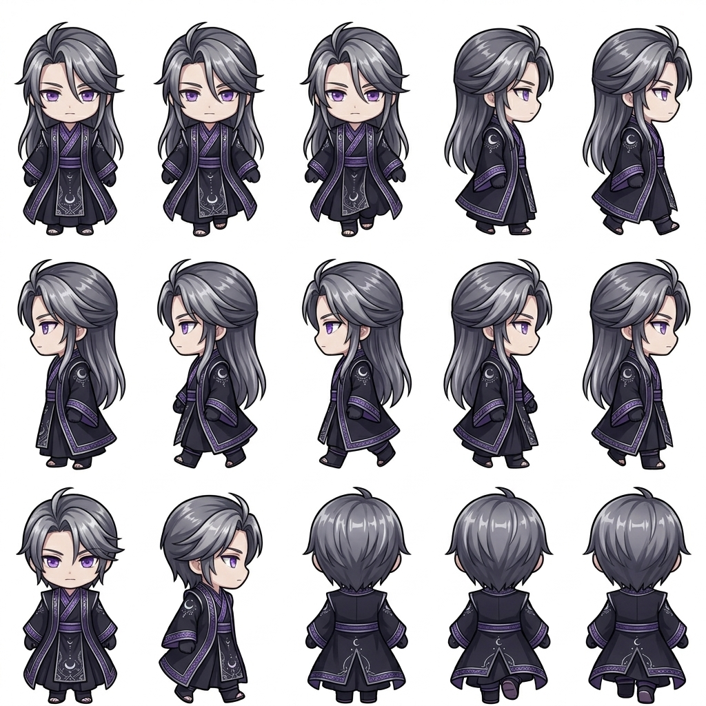

# Character Concept: Valdris — The Shadow Emperor

## 👤 Profile
- **Full Name**: Valdris
- **Title**: The Shadow Emperor / Scholar of Truth
- **Gender**: Male
- **Origin**: Ancient Aethoria (Pre-Shattering)
- **Role**: Primary Antagonist / Final Boss
- **Aesthetic**: Obsidian scholar's robes, violet starlight energy, clinical and indifferent demeanor.

## 📖 Lore
Valdris was once the realm's most brilliant scholar, dedicated to studying the Five Elemental Seals. His obsession with conquering death led him to the Forbidden Void. Over six centuries, he shattered four of the Five Seals, devouring their power and becoming a being of pure cosmic shadow.

He does not hate the world; he is simply indifferent to its existence. To him, all life is a temporary glitch in the perfect silence of the void. He believes that by consuming all worlds, he is bringing them to a state of eternal peace.

## ⚔️ Combat Style: The End of All Things
Valdris does not use physical weapons. He manipulates the fundamental forces of the Void.

- **Void Fracture**: Rips a hole in reality, dealing massive shadow damage to a single target.
- **Cosmic Consume**: A wide-area attack that drains MP from all party members to fuel his own starlight shield.
- **Indifference (Passive)**: Status effects have a 50% chance to be automatically "erased" from him at the start of his turn.

## 🗺️ Story Beats
1. **The Encounter**: The party first meets his projection in the Shadow Reach, where he assesses their "composure" and "will."
2. **The Inner Sanctum**: He waits on a throne of shadow and starlight at the heart of the Eternal Void.
3. **The Transformation**: After his primary form is defeated, he staggers and fractures into starlight, revealing the human scholar beneath.
