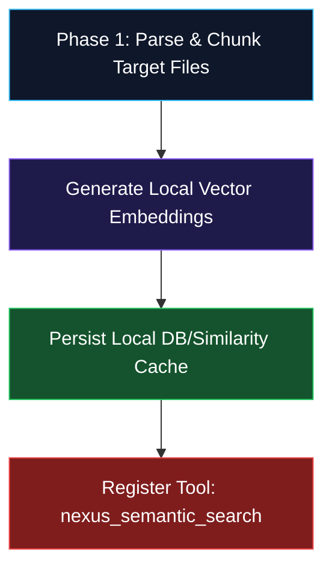

# Concept: RAG Vectorization Integration Pipeline

**Authoritative Semantic Indexing Blueprint for Nexus MCP Automation**  
**Accountability**: The Curator (Pipeline Maintainer) & The Chronicler (Lore Lead)  
**Status**: Formal Staging Proposal (Pipeline Rule Strictly Enforced)

---

> [!IMPORTANT]
> **Pipeline Rule Enforcement**  
> All retrieval-augmented generation frameworks, chunking logic, and file boundaries defined below must pass full concept verification before native implementation inside the Model Context Protocol server.

---

## 🗂️ 1. Core Objectives & System Boundaries

To eliminate substring search limitations and empower client LLM agents with flawless semantic understanding, we establish an incremental, localized **Retrieval-Augmented Generation (RAG)** vector indexer directly inside our standalone Nexus MCP Server.

### Non-Negotiable Exclusion Boundary
To preserve absolute Source of Truth integrity, the vector space functions as our **Immutable Ground Truth Anchor**. 
* **EXCLUDED**: All files residing within the `_concepts/` directory are strictly restricted from index generation to prevent context contamination from un-finalized or fluid draft mechanics.
* **DEFERRED**: The massive `data/enemies.json` host registry is explicitly decoupled from Phase 1 indexing to secure pipeline stability.

---

## 📂 2. Phase 1 Vectorization Targets (The Semantic Baseline)

Indexing will proceed strictly one by one across our validated production JSON arrays:

### Collection A: Canonical Lore Matrix
* **Target File**: `data/lore_fragments.json`
* **Chunking Strategy**: Embed individual fragment blocks mapping their unique ID, contextual title, category, region token, and comprehensive atmospheric subtext strings.
* **Retrieval Intent**: Contextual grounding for automated story arc generation and narrative continuity.

### Collection B: Class & Growth Vectors
* **Target File**: `data/classes.json`
* **Chunking Strategy**: Serialize distinct class blueprints, mapping attribute multipliers, stat growth parameters, and composite equipment scaling arrays.
* **Retrieval Intent**: Zero-drift parameter projection verification.

### Collection C: Party & Unlock States
* **Target Files**: `data/characters.json` and `data/character-unlocks.json`
* **Chunking Strategy**: Embed base attribute sheets, default passive bindings, and explicit milestone trigger flags.
* **Retrieval Intent**: Validating party stat builds and continuous recruitment checks across arcs.

### Collection D: Active Quest Frameworks
* **Target File**: `data/quests.json`
* **Chunking Strategy**: Map active quest IDs, prerequisite tags, completion target thresholds, and persistent NPC reward structures.
* **Retrieval Intent**: Maintaining multi-arc objective loops without dangling logic references.

---

## 🛠️ 3. Incremental Implementation Workflow



### Step 1: Storage Layer Initialization
* Implement simple, lightweight vector indexing (e.g., lightweight localized cosine-similarity cache arrays or an embedded store like `hnswlib` / `Chroma`) directly inside `tools/nexus-mcp/handlers/ragIndexer.js`.

### Step 2: Incremental File Integration
* Build isolated parsing buffers for `lore_fragments.json` first to audit query speed and semantic accuracy before hooking in secondary collections.

### Step 3: Tool Exposure
* Update `tools/nexus-mcp/index.js` to register a new query interface:
```json
{
  "name": "nexus_semantic_search",
  "description": "Performs fast semantic vector retrieval across verified canonical lore matrices, party configurations, and active quest logs.",
  "inputSchema": {
    "type": "object",
    "properties": {
      "collection": { "type": "string", "enum": ["lore", "classes", "characters", "quests"] },
      "query": { "type": "string", "description": "Natural language search intent string." }
    },
    "required": ["collection", "query"]
  }
}
```

### Step 4: Re-vectorization Sync Loop
* Build an automated upsert hook (`nexus_sync_rag`) allowing developers to instantly refresh active indexes whenever source files or concept frameworks evolve into production reality.
