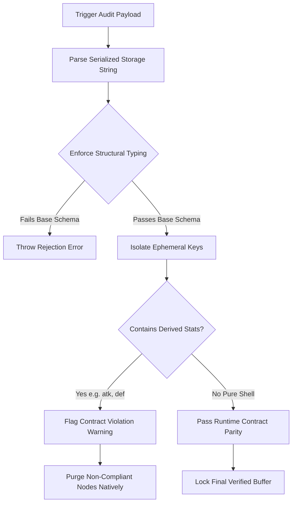

# 🛡️ Concept: Static Save-Contract Verifier (`nexus_verify_save_contract`)

**Category**: Mechanics / Infrastructure Automation  
**Proposed Agent Owner**: Aethon (The System Architect)  
**Target Subsystem**: `js/systems/save-contract.js` & Native PWA Storage Layer  

---

## 📑 1. Executive Summary
The **Save Contract** is a critical invariant of the Shattered Nexus runtime engine designed to prevent cumulative floating-point save bloat and derived modifier corruption. To support a complete multi-arc campaign playthrough, persisted storage slots MUST capture a comprehensive **Persisted State Core** while strictly isolating runtime combat math.

The authorized base identity schema consists precisely of:
1. **Base Attributes**: `lv`, `exp`, `gold`, `hp`, `mp`, `isKO`.
2. **Player Inventory & Gear**: Serialized item vault arrays and active character equipment mappings (`weapon`, `armor`, `relic`).
3. **Narrative & Quest Logic**: Global string trigger indices (`storyFlags`) alongside hunt/gather tracking registries (`activeQuests`, `completedQuests`).
4. **Unlocked Party Roster**: Active recruit keys (`unlockedCharacters`) identifying available combat allies.
5. **Spatial Coordinates**: Last mapped location identifier arrays (`mapId`, `x`, `y`).

Derived combat metrics (such as buffed attack power, active armor defensive calculations, or transient encounter parameters) are strictly forbidden from serialization and must be recomputed dynamically at runtime startup.

---

## 🏗️ 2. Architectural Flow & Sandboxing Logic



---

## 🛠️ 3. Execution Pipeline & Rule Heuristics

### A. Deep Static Keys Isolation
The verifier performs automated static tree traversal mapping persisted object keys. If any object structure nested inside `slot_X` exposes runtime calculation tags (`atk`, `def`, `speed`, `evasion`), the compilation step naturally fails with an explicit code telemetry record.

### B. Positional State Verification
Scans saved `Diamond Formation` positioning properties to guarantee no intermediate or transient targeting logic references are serialized to disk storage. Only absolute character string indexes (`aya`, `tao`) mapped directly to slot indices (`0`, `1`, `2`, `3`) are allowed.

### C. Sample AST Interface Spec
```json
{
  "name": "nexus_verify_save_contract",
  "description": "Statically audits storage serialization objects to ensure strict adherence to the minimal save contract framework.",
  "inputSchema": {
    "type": "object",
    "properties": {
      "slotKey": {
        "type": "string",
        "description": "Target storage string register slot (e.g., 'nexus_save_0')."
      },
      "autoClean": {
        "type": "boolean",
        "description": "Automatically strips out redundant dynamic variables from target JSON payload strings before save state commitment."
      }
    },
    "required": ["slotKey"]
  }
}
```

---

## 🔗 4. Operational Alignment
* **Source Engine Logic**: Relies natively on `validateSaveStructure` algorithms hosted within `js/systems/save-contract.js`.
* **Telemetry Output**: STDIO arrays reporting absolute block payload validation telemetry metrics.
* **Pre-Deployment Trigger**: Runs synchronously alongside static asset caching checks (`nexus_bump_cache`) to guarantee total deployment release safety.
