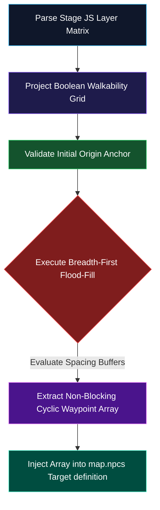

# Concept: Smart Patrol Vector Routing (Atlas Automation)

**Authoritative Spatial Pathfinding Blueprint for Nexus Level Design**  
**Accountability**: Atlas (World Builder) & Aethon (Architect)  
**Status**: Formal Staging Proposal (Pipeline Rule Strictly Enforced)

---

> [!IMPORTANT]
> **Pipeline Rule Enforcement**  
> All procedural coordinate pathfinding formulas, spatial matrix loops, and MCP schema definitions below must undergo complete peer verification before engine implementation inside the Model Context Protocol server. Direct manipulation of staging buffers is prohibited.

---

## 🗂️ 1. Core Objectives & System Boundaries

Handcoding exact waypoint arrays (`[ {x: 12, y: 14}, {x: 12, y: 15} ]`) for dynamic patrolling NPCs and wandering stage bosses introduces severe spatial regression vectors. Entities frequently collide with unmapped decorations or cause game loops by sealing narrow 1-tile bottlenecks against the player.

To elevate level design into an autonomous state machine, we establish a **Dynamic Patrol Vector Router** running standalone spatial computation across raw map definitions.

### Cartesian System Constraints
* **Immutability of Static Collision**: The pathfinding layer treats layer-0/layer-1 `walkable: false` definitions as absolute, impenetrable Cartesian walls.
* **Manhattan Spacing Rules**: Generated cycle loops must strictly avoid passing within **1 tile** of any known `playerStart` or `type: 'teleport'` destination nodes to prevent unavoidable player interception loops immediately upon stage loading.

---

## 📂 2. Spatial Matrix Pre-processing & Extraction

Before path routing execution, the target stage file (e.g., `js/map/data/map-riverlands-crossing.js`) undergoes localized structure extraction:

### Step A: Binary Grid Projection
* The router parses the universal multi-layer arrays alongside global tile rules (`TILE_DEFS`) to construct a two-dimensional Boolean matrix representing raw **Walkable Space** vs **Blocked Nodes**.

### Step B: Entity Anchor Grounding
* The target dynamic entity's absolute initialization anchor (`originX`, `originY`) is validated against the binary matrix to ensure it does not spawn inside a blocked sector.

---

## 🧠 3. Dynamic Pathfinding & Loop Generation



### Core Logic: Cyclic Breadth-First Search (BFS)
Rather than simple linear A* paths from point A to point B, the engine constructs a non-intersecting closed-loop trajectory:
1. **Flood-Fill Radius**: Explores valid walkable nodes outward from the origin up to a defined `cycleLength` boundary.
2. **Bottleneck Avoidance**: Measures surrounding open cell weight. If a cell represents a single-width passage connecting two vast regions, it is flagged with negative traversal weight to prevent blocking core progression flows.
3. **Loop Closure**: Traces back along adjacent vector coordinates to establish a fluid, infinite animation array supporting top-down movement interpolation.

---

## 🔌 4. Tool Exposure Contract (`nexus_generate_patrols`)

To allow Atlas to execute generation workflows dynamically, we define the following interface contract for insertion into `tools/nexus-mcp/index.js`:

```json
{
  "name": "nexus_generate_patrols",
  "description": "Parses walkable stage matrices to calculate cyclic, non-blocking patrol loops for dynamic entities while preserving spawn isolation buffers.",
  "inputSchema": {
    "type": "object",
    "properties": {
      "mapFileName": {
        "type": "string",
        "description": "Target canonical stage filename inside js/map/data/ (e.g., 'map-verdant-vale.js')."
      },
      "entityId": {
        "type": "string",
        "description": "Unique string ID of the dynamic NPC or patrolling boss entity."
      },
      "cycleLength": {
        "type": "integer",
        "description": "Maximum path node length for the patrol sequence loop. Defaults to 8 steps."
      },
      "originX": { "type": "integer", "description": "Absolute starting column index." },
      "originY": { "type": "integer", "description": "Absolute starting row index." }
    },
    "required": ["mapFileName", "entityId", "originX", "originY"]
  }
}
```

---

## 🚀 5. Engine Consumption Strategy

Once successfully generated, the waypoint coordinate array is embedded directly inside the target entity's staging buffer:
```javascript
{
  id: "wandering_scout",
  name: "Scout Kaelen",
  x: 14,
  y: 32,
  patrolRoute: [
    {x: 14, y: 32}, {x: 15, y: 32}, {x: 16, y: 32},
    {x: 16, y: 33}, {x: 15, y: 33}, {x: 14, y: 33}
  ],
  patrolSpeedMs: 1200
}
```
This data structure acts as an absolute native payload consumed cleanly by our runtime rendering system during map transition phases.
