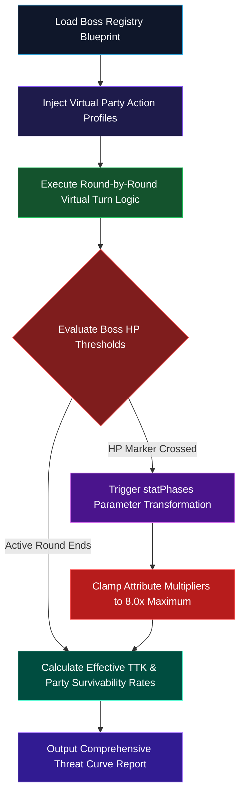

# Concept: Asymmetric Threat Curve Validator (Aegis VM Engine)

**Authoritative Mathematical Sandbox Blueprint for Nexus 4v1 Encounters**  
**Accountability**: Aegis (Combat & Balance) & Aethon (Architect)  
**Status**: Formal Staging Proposal (Pipeline Rule Strictly Enforced)

---

> [!IMPORTANT]
> **Pipeline Rule Enforcement**  
> All kinetic simulation formulas, virtual action profiles, mitigation clamps, and MCP schema definitions defined below must pass full peer architectural review before engine implementation inside the Model Context Protocol server. Direct manipulation of VM verification logic without staging approval is strictly prohibited.

---

## 🗂️ 1. Core Objectives & Kinetic Math Boundaries

Balancing standard RPG battles around basic one-to-one attacks breaks down completely during asymmetric climax boss encounters. In Shattered Nexus, the party exercises a strict **4:1 turn advantage** per combat round. Striker units unleash stacked elemental arts, tanks invoke mitigation shields, and support units expend finite MP resources to out-sustain massive incoming area-of-effect sweeps.

To evaluate these encounters reliably without endless manual playtesting loops, we establish the **Asymmetric Threat Curve Validator**—a sandboxed execution tool that runs automated simulation matrices inside specialized virtual machine contexts.

### Non-Negotiable Mathematical Clamps
* **Universal Function Signature**: All simulated stat comparisons strictly replicate the engine-native signature `(PowerStat, MitigationStat, Multiplier, OptionsObject)` to prevent evaluation divergence.
* **Hybrid Magic Mitigation Rules**: Magic-based ability sweeps evaluate resistance strictly through the composite formula:
  $$\text{Effective Mitigation} = (\text{def} \times 0.25) + (\text{mag} \times 0.25) + (\text{level} \times 0.5)$$
* **Absolute Ceiling Cap**: Under no circumstance can cumulative phase buffs or status modifiers push any core attribute beyond the absolute **8.0x Multiplier Ceiling**.

---

## ⚔️ 2. Asymmetric Action Modeling (4v1 Matrix)

Rather than simulating random basic attacks, the validator models deterministic, round-by-round **Party Action Profiles** mapped against the boss's custom AI scripts:

### Step A: Party Output Projections
* **Burst Profile**: Striker units prioritize highest-scaling available abilities (`abilities[]`) fueled by standard MP generation curves.
* **Sustain Profile**: Healing units trigger absolute restorative sweeps whenever overall party health dips below critical survival thresholds ($< 40\%$).
* **Mitigation Anchoring**: Frontline actors cast taunt mechanisms or active defense multipliers to absorb high-threat single-target boss routines.

### Step B: Boss Turn Economy Sweeper
Because the boss acts alone, the engine calculates the minimum effective Time-to-Kill (TTK) across two primary states:
1. **The Fear Phase**: The boss unleashes dynamic phase ultimate attacks targeting overall party sustain limits.
2. **The Power Phase**: The boss undergoes baseline cooldown recovery while party output reaches its theoretical damage ceiling.

---

## 📊 3. Dynamic Threshold Interception & Multi-Phase Math



### Core Logic: Cascading Phase Evaluation
When the simulated boss's HP drops below marked boundaries defined in `enemies.json` (e.g., `< 50%` or `< 25%`), the engine evaluates the corresponding `statPhases` array:
* It resets internal cooldown states dynamically.
* It recalculates physical and magical mitigation metrics instantly.
* It verifies that any instant-cast narrative actions do not introduce mathematical `NaN` propagation across shared active buffers.

---

## 🔌 4. Tool Exposure Contract (`nexus_validate_threat_curve`)

To empower Aegis to run multi-tier combat diagnostics deterministically, we define the following schema for insertion into `tools/nexus-mcp/index.js`:

```json
{
  "name": "nexus_validate_threat_curve",
  "description": "Simulates round-by-round asymmetric 4v1 combat scenarios against target boss entities inside sandboxed VM contexts to validate Time-to-Kill (TTK) statistics, verify phase transformations, and enforce absolute mitigation clamps.",
  "inputSchema": {
    "type": "object",
    "properties": {
      "targetBossId": {
        "type": "string",
        "description": "Unique identifier key of the canonical boss entity inside enemies.json (e.g., 'sunken_leviathan')."
      },
      "partyAverageLevel": {
        "type": "integer",
        "description": "Simulated base level configuration for the 4-member striking party."
      },
      "simulatedRounds": {
        "type": "integer",
        "description": "Maximum round boundary limit for the automated sweep. Defaults to 20 rounds."
      },
      "partySustainProfile": {
        "type": "string",
        "enum": ["aggressive", "balanced", "defensive"],
        "description": "Virtual operational strategy governing party resource allocation and healing loop sensitivity."
      }
    },
    "required": ["targetBossId", "partyAverageLevel"]
  }
}
```

---

## 🚀 5. Engine Consumption Strategy

The generated validation report provides the production team with highly structured quantitative diagnostics:
```json
{
  "encounterAnalyzed": "sunken_leviathan",
  "simulationMetrics": {
    "totalRoundsSimulated": 14,
    "partySurvivalRate": "100.0%",
    "effectiveBossTTKSeconds": 84.5,
    "maxAttributeMultiplierHit": "4.2x",
    "statusCeilingViolations": 0
  },
  "phaseTransformAudit": [
    { "phaseIndex": 1, "triggerThreshold": "100%", "status": "STABLE" },
    { "phaseIndex": 2, "triggerThreshold": "50%", "status": "STABLE", "mitigationShift": "+25.0%" }
  ],
  "balanceEquilibrium": "PRESERVED"
}
```
This payload enables immediate visual evaluation of the Arc Threat Curve without requiring runtime modification of primary data matrices.
