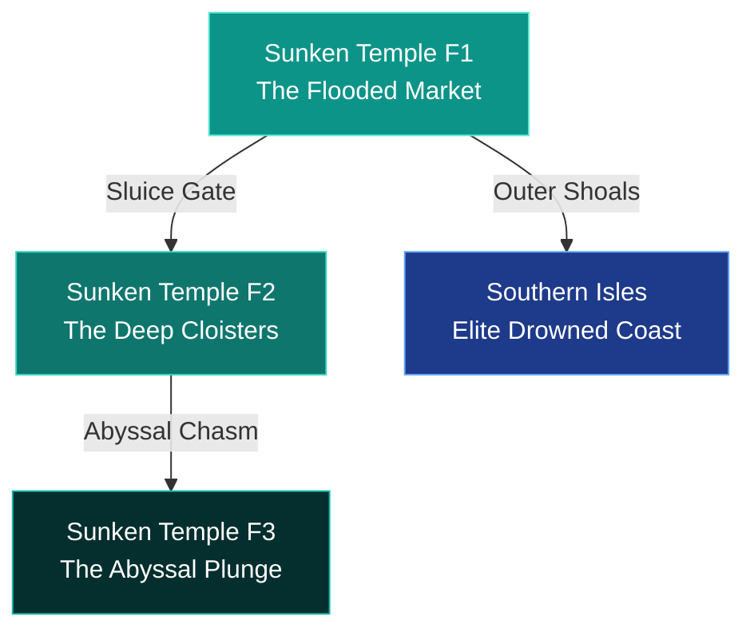

# Concept: Arc 4 — The Sunken Temple (Sea of Pearls)

**Authoritative Lore, Multi-Floor Staging, & Systems Integration Blueprint**  
**Accountability**: The Chronicler (Narrative Lead), Atlas (Worldbuilder), & Vivid (Aesthetic Lead)  
**Status**: Premium Concept Blueprint (Ready for Engine Implementation Pipeline)

---

> [!IMPORTANT]
> **Pipeline Rule Adherence**  
> All features, actor placements, and floor mapping arrays outlined below originate strictly from this document before being authorized for native code injection by **The Curator**. Direct manual addition of units to `characters.json` is prohibited.

---

## 📜 1. Exhaustive Regional Lore Matrix

### The Primordial Baseline: The Water Leyline
Long before the dawn of the Five Civilizations, the primordial system architects of the **Sky Archive** constructed deep-ocean trench relays to balance Aethoria's atmospheric condensation. The **Water Leyline** was anchored within the absolute deepest pelagic rift to act as a global pressure buffer, regulating tidal stability and preventing thermal ocean runaway.

The fourth magnificent civilization, the **Tide Priests**, built their society around these tranquil coastal waters. Governed by High Archpriest **Oremis**, they lived in joyous service to healing and natural philosophy. At the center of their culture was the **Submerged Market**: vast white pearlescent stone terraces where trading vessels secured their ropes to heavy iron rings, healers operated from floating barges, and children swam alongside peaceful marine elementals.

### Valdris’s Method: The Data Compression Overload
True to his immutable doctrine, Valdris did not attack the Tide Priests with swords. Oremis carried immense, quiet guilt over the mortal patients who perished from incurable deep-sea marine corruptions. Valdris simply approached Oremis with an elegant offer that required no malice: the physical means to descend into the absolute deepest ocean trenches where the unadulterated origin of the Water Seal resided, promising ancient, unfiltered medical knowledge.

> [!NOTE]
> **The Data Saturation Event**  
> Oremis accepted without hesitation. But what he absorbed at the absolute depth was not a localized medical formula—it was the raw, uncompressed elemental memory of the entire ocean across millennia. The sheer computational density of the foreign data fractured his human awareness.

### The Overwritten Population: Lore of the Kraken
Upon returning to the surface terraces, the unfiltered **Water Seal** memory broadcasted outward via pure elemental proximity. The healers who worked beside Oremis changed first. Then the local citizens. Slowly, peacefully, the entire population had their underlying source code overwritten by deep-sea pressure logic, transforming them into persistent, mindless aquatic guardians (**Armored Crabs**, **Deep Slimes**).

> [!CAUTION]
> **The Descent of Oremis**  
> Recognizing the irreversible cascade, Oremis withdrew to the central deep plunge chamber to complete the transition alone. His human form collapsed and restructured into the apex entity: the **Kraken** (`kraken`). He became the very corruption he went to cure, given form in the place he went to find a cure. He remains in the deep, siphoning regional memory upstream to Valdris while still trying, in some unreachable automated way, to heal.

---

## 🗺️ 2. Multi-Floor Staging System

To satisfy our spatial architecture and enforce Vivid's **50/50 Walkable Ground Standard**, the Sunken Temple ecosystem spans **three distinct descending elevations**:



### Floor 1: `sunken_temple_f1` (The Flooded Market)
* **Grid Layout**: `80x40` layout featuring shallow water platforming arrays.
* **Aesthetic Profile (Vivid's Domain)**: Deep aquamarine channels (`#0d9488`) washing over pearlescent white stone tiles (`#f8fafc`). Subdued soft blue gradients layer the Z-depth.
* **Custom Rendering Filter**: `filter: hue-rotate(5deg) saturate(1.2) brightness(1.05);`
* **Mechanics**: Automated high-tide sluice gates. Periodically exposes or submerges pathing bridges based on dynamic turn counters.

### Floor 2: `sunken_temple_f2` (The Deep Cloisters)
* **Grid Layout**: `80x40` submerged stone archway paths.
* **Aesthetic Profile**: Dark teal water vectors (`#0f766e`) illuminated by rusted, ancient floating lamps.
* **Custom Rendering Filter**: `filter: contrast(1.1) saturate(0.9) brightness(0.85);`
* **Mechanics**: Unidirectional current tiles that push the party backward along the coordinate grid unless anchored by localized magnetic lead tokens.

### Floor 3: `sunken_temple_f3` (The Abyssal Plunge)
* **Grid Layout**: Compact `40x40` deep-sea pressure depth.
* **Aesthetic Profile**: Total ambient abyssal darkness (`#020617`) pierced solely by glowing blue bioluminescent divine sigils.
* **Mechanics**: Absolute crushing pressure. Requires active Water Fragment synchronization to prevent absolute party crushing.

---

## 📜 3. Enriched Immersive Quest Pipelines

Interactive actors drive material progression natively mapping to `data/npcs.js` and `data/story/arc_4.json`:

### Quest 1: The Memory Jars
* **Giver**: **The Mire Witch** (Exiled Healer) at `F1 Coordinates (15, 8)`.
* **Rich Dialogue Matrix**:
  * **Start**: *"Ah, travelers carrying dry air. You look at those iron rings hammered into the flooded stone and see decoration. They are a market that forgot to close. I traded from those platforms before the Archpriest brought the deep up to meet us."*
  * **Exchange**: *"I trade in memories now—specifically memories people believe they no longer need. Give me your `Sorrowful Remembrance` token, and I will hand you the `Tidal Antidote` capable of neutralizing the outer gate's deep-sea pressure locks."*
  * **Persistent Subtext**: *"I keep the forgotten memories in these small glass jars near the hearth. I tell myself I am holding them in case their owners return. We both know no one comes back for things they decided to give away."*
* **System Rewards**: Instantly grants `1x Tidal Antidote` + unlocks her customized mystical herb shop.

### Quest 2: The Midnight Beacon
* **Giver**: **The Old Mariner** (Lighthouse Keeper) at `F2 Coordinates (72, 35)`.
* **Rich Dialogue Matrix**:
  * **Start**: *"Every midnight, the phantom ship passes the rocks. Its crew died crossing the elemental instability when the third pillar fell. It has completed its route thousands of times since, searching for a port that no longer exists."*
  * **Objective**: Harvest $3\times$ `Bioluminescent Glands` from deep-sea slimes to keep the outer beacon tower fueled.
  * **Resolved**: *"The oil burns clearly now. I leave the light burning anyway. It feels right that something is still trying."*
* **System Rewards**: Unlocks safe passage routes to the outer expansion layer (`Southern Isles`).

### Quest 3: The Severed Line
* **Giver**: **Submerged Echo of Oremis** at `F3 Coordinates (20, 10)`.
* **Rich Dialogue Matrix**:
  * **Start**: *"Do not go down. The origin... it was too vast. It was not a cure. It was the memory of every drowning since the world cooled."*
  * **Warning**: *"My body... it is down there still, feeding his network. Cut the lines. Break what I have become before the tide takes your names as well."*
* **System Hook**: Reduces the starting Max HP of the Kraken encounter by $10\%$ if the party disables the three surrounding memory anchors prior to plunging.

---

## ⚔️ 4. Mathematical Boss Encounter Layer

> [!TIP]
> **VVI Source of Truth Integration**  
> All mathematical frameworks adhere strictly to the combat mechanics governed by `claude.md`.

### Tier 1: The Exploration Obstacle — `Sunken Leviathan`
* **Grid Placement**: Massive serpentine blocking sprite patrolling `F1 Coordinates (65, 22)`.
* **Identity**: Primordial oceanic apex entity drawn to local elemental saturation.
* **Explicit Combat Math**: Employs dynamic current-based action manipulation. Attacks push targets back on the timeline queue proportionally to the attacker's current speed ratio:
$$\text{Queue Delay} = 150 \times \left(\frac{\text{Leviathan Speed}}{\text{Target Speed}}\right)$$

### Tier 2: The Arc Story Climax — `Kraken`
* **Grid Placement**: Triggered automatically upon plunging into the central deep altar pool at `F3 Coordinates (20, 30)`.
* **Identity**: The physical body of High Archpriest Oremis, overwritten by compressed Water Seal memory.
* **Cinematic Integration (Wired for Vivid)**: Screen plunges into absolute abyssal blackness (`#020617`), pierced by glowing blue bioluminescent sigils drawing inward to outline the tragic, massive deep-sea tentacles.
* **Explicit Combat Math**: Implements a continuous deep-sea pressure passive loop. Reduces all incoming physical and magical damage by a flat percentage based on ambient depth arrays:
$$\text{Mitigation Factor} = 0.25 + \left(0.05 \times \text{Active Submerged Turns}\right)$$

---

## 💎 5. Premium Relic & Drop System

Defeating these entities registers unique progression items into the database:

```json
{
  "relic_water_tide_jewel": {
    "name": "Tide Jewel of the Archpriest",
    "tier": "EPIC",
    "description": "Flawless deep-sea pearl. Renders the party completely immune to aquatic current manipulation and grants +15% healing effectiveness to all support skills.",
    "stat_bonus": { "hp": 150, "spd": 12 }
  },
  "item_abyssal_ink": {
    "name": "Vial of Abyssal Ink",
    "type": "CONSUMABLE",
    "description": "Concentrated ocean memory. Inflicts absolute Blindness on target enemy unit for 3 continuous turns.",
    "value": 950
  }
}
```

---

## 🔗 6. Story Climax & Divine Integration

Following the defeat of the Kraken, the narrative runner executes two critical sequential script hooks:

1. **The Divine Binding Discovery (`essabella_kraken`)**:
   - As the waters calm, the party discovers a pristine celestial chain of divine inscription binding the deep chamber locks. 
   - **Rei** recognizes the glowing celestial mark immediately. He kneels and holds the broken seal in absolute silence before revealing that **Lady Essabella** descended and locked this creature here centuries ago to prevent Valdris from siphoning its crushing pressure against the surface world.

2. **Valdris’s Fourth Appearance (`temple_valdris_speaks`)**:
   - The detached presence of the Shadow Emperor settles over the plunge pool. He addresses each hero by name with genuine curiosity.
   - He observes **Lulu's** persistent dancer's hope, names **Rei's** two thousand years of karmic endurance, and evaluates **Aya's** absolute composure. In six centuries of managing a glitched world, no mortal party has reached the fourth pillar intact. He finds their persistence genuinely worth examining before dissolving back into the void.

---

## 🛠️ 7. Implementation Lifecycle Check
1. **Grid Allocation**: Emit the standard JSON coordinate matrices for `map-sunken_temple_f1.json` through `f3`.
2. **Dialogue Binding**: Inject the serialized text loops natively inside `data/story/arc_4.json`.
3. **PWA Increment**: Update Service Worker cache version arrays to force-reload cached game engine scripts.
