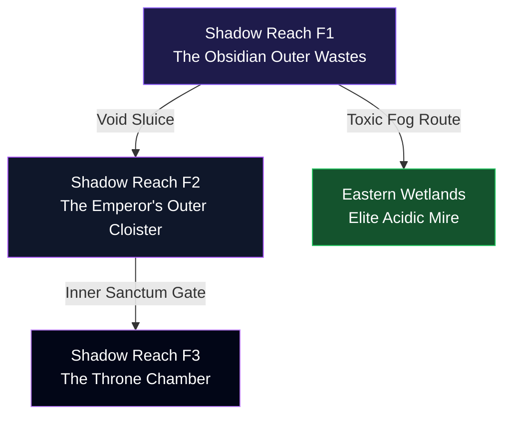

# Concept: Arc 5 — Shadow's Heart (Shadow Reach & Wetlands)

**Authoritative Lore, Multi-Floor Staging, & Systems Integration Blueprint**  
**Accountability**: The Chronicler (Narrative Lead), Atlas (Worldbuilder), & Vivid (Aesthetic Lead)  
**Status**: Premium Concept Blueprint (Ready for Engine Implementation Pipeline)

---

> [!IMPORTANT]
> **Pipeline Rule Adherence**  
> All narrative structures, character recruit hooks (**Rex**), and multi-floor coordinates detailed below originate strictly from this document before native staging integration. Direct hardcoded unit instantiation in `characters.json` without concept auditing is prohibited.

---

## 📜 1. Exhaustive Regional Lore Matrix

### The Primordial Baseline: The Shadow Leyline
In the era pre-dating all known historical frameworks, the overarching administrators of the **Sky Archive** constructed highly pressurized kinetic dampeners at the central geographic core. The **Shadow Leyline** was engineered not as a channel for malevolence, but as an absolute planetary data sink—a foundational gravity well designed to safely absorb, compress, and archive volatile excess elemental memory before it could trigger regional space-time fracturing.

### Valdris’s Method: The Despair Compression Arrays
When Valdris claimed the core sanctums following the Shattering of the Nexus, he understood the native logic of the data sink perfectly. He did not dispatch shadow phalanxes to wipe out the surrounding borderlands. Instead, he systematically inverted the Leyline's input/output valves. He concentrated centuries of unexpressed collective grief, ambient atmospheric despair, and the severed memory strings of destroyed civilizations directly into the physical air density of the **Shadow Reach**. 

> [!NOTE]
> **The Logic of Suffocation**  
> In the Shadow Reach, ambient air density behaves like localized space-time static. Even shadows cast secondary shadows. Mortals entering the perimeter do not die of simple physical trauma; their internal processing speed drops to zero as their minds are forced to compute the accumulated despair of countless unmade worlds simultaneously.

### The Inverted Vanguard: Lore of the Fallen Angel (Veleth)
**Commander Veleth** (`fallen_angel`) was originally the foremost vanguard general of the heavenly realms, directly commissioned by **Lady Essabella** to breach the early rift boundaries. Essabella sent Veleth forward knowing precisely what the dark would do to him, counting on his legendary endurance to hold the line.

Valdris did not execute Veleth in combat. Instead, he isolated Veleth's primary instruction set and applied an absolute operational inversion:
$$\text{executeGrace()} \longrightarrow \text{executeSiphon()}$$
By overriding the instruction for *defense*, Valdris locked Veleth in a calcified state of void fusion. Veleth serves as the living host of the **Seal Fragment of Shadow**, striking down intruders while his residual consciousness watches from behind frozen eyes, powerless to intervene.

### Sourced from the Jars: Lore of the Flesh Abomination
The **Eastern Wetlands** (the Elite Expansion region unlocked post-Arc 5) is home to the **Flesh Abomination** (`abomination`). This entity is not a single coherent biological unit. Over decades, the discarded memories traded to the **Mire Witch** by desperate travelers leaked from her cracked collection jars into the deep, highly acidic mire. 

> [!WARNING]
> **The Silt Colony**  
> The accumulated organic data of everything that died in the swamp over three centuries absorbed these discarded memories. The swamp soil achieved localized critical mass, forming an immense, shifting biological colony driven solely by the corrupted memory of hunger. It is a mass of decomposition given purpose by the void's overarching network logic.

### The Living Specimen: Lore of King Rex
Deep within the Emperor's inner sanctum, bound by shadow-iron chains that nullify physical stats, stands **Rex**. Pulled through an inter-dimensional rift from another golden nation consumed by Valdris, Rex was kept alive intentionally. Valdris placed him directly beside the central siphoning core to serve as a living psychological experiment: *observe the decay of a sovereign's will when forced to watch eternity dismantle everything he ever led.* Rex held his composure for six centuries, waiting for an unpredictable variable that refused to be unmade.

---

## 🗺️ 2. Multi-Floor Staging System

To enforce our strict geographic progression metrics, the Arc 5 latitude scales across **three descending conceptual floor arrays**:



### Floor 1: `shadow_reach_f1` (The Obsidian Outer Wastes)
* **Grid Layout**: Standard `80x40` open layout adhering to Vivid's **50/50 Walkable Ground Standard**.
* **Aesthetic Profile (Vivid's Domain)**: Deep ultraviolet twilight (`#1e1b4b`) washing over jagged black basalt platforms (`#09090b`). 
* **Custom Rendering Filter**: `filter: saturate(1.6) contrast(1.2) hue-rotate(20deg) brightness(0.85);`
* **Mechanics**: **Static Density Hazard**. Moving across unmapped shadow tiles costs double movement allocation vectors. Players must navigate via glowing void-vein pathing lines.

### Floor 2: `shadow_reach_f2` (The Emperor's Outer Cloister)
* **Grid Layout**: `80x40` shifting spatial corridors.
* **Aesthetic Profile**: Polished dark marble (`#020617`) illuminated by pulsing violet leyline conduits (`#9333ea`).
* **Custom Rendering Filter**: `filter: drop-shadow(0 0 12px rgba(168,85,247,0.5)) contrast(1.1);`
* **Mechanics**: Spatial looping triggers. Stepping onto specific unanchored trigger tiles instantly teleports the leading unit back to the starting quadrant unless carrying a stabilized `Leyline Anchor`.

### Floor 3: `shadow_reach_f3` (The Throne Chamber)
* **Grid Layout**: Compact `40x40` duel ring.
* **Environment**: The absolute inner sanctum. Overarched by a massive cracked celestial ceiling leaking ancient starlight. Houses the final encounter altar for Commander Veleth and the recruitment lock for King Rex.

---

## 📜 3. Enriched Immersive Quest Pipelines

Regional narrative delivery is natively driven by persistent actors syncing directly to `data/npcs.js` and `data/story/arc_5.json`:

### Quest 1: The Price of Spores
* **Giver**: **The Mire Witch** at `Wetlands Coordinates (18, 12)`.
* **Rich Dialogue Matrix**:
  * **Start**: *"You want something. Everyone who finds this fire wants something. All the paths are corrupted—that stopped being useful information about six years ago."*
  * **Exchange**: *"I can give you the spores to clear the fog in the deep mire. They'll cost you a memory you don't need. I ask. You'd be surprised how many people know exactly which memory they've been carrying that does them no good and haven't had anyone to give it to."*
  * **Persistent Subtext**: *"I keep them in the jars over there by the fire. In case someone comes back for them. No one has yet. But I was a healer once, and healers hold things for people who might need them again later."*
* **System Rewards**: Clears the heavy toxic fog arrays blocking exploration of the Eastern Wetlands map + unlocks standard inventory access to `Tidal Antidote` nodes.

### Quest 2: A Map Worth the Ink
* **Giver**: **Lost Soul** (The Former Cartographer) at `Wetlands Coordinates (62, 28)`.
* **Rich Dialogue Matrix**:
  * **Start**: *"The swamp is so soft... it feels like a blanket. I used to be a cartographer. I made maps of the five civilizations. Beautiful maps—hand-inked, with proper borders and trade routes."*
  * **Conflict**: *"None of those maps are accurate anymore. All the borders are wrong. All the routes lead somewhere they shouldn't. I kept trying to update them and there was always something new that had changed. I got tired."*
  * **Resolution Hook (Aya's Prompt)**: *"A map drawn after the world is restored would be worth making."*
  * **Resolved**: *"...I hadn't thought about that. That would be a map worth the ink."*
* **System Rewards**: Unlocks the persistent `Map Overlay Widget` revealing hidden gathering nodes across all previous regional maps.

---

## ⚔️ 4. Mathematical Boss Encounter Layer

> [!TIP]
> **VVI Source of Truth Integration**  
> All programmatic output curves match the global combat scaling equations documented in `claude.md`.

### Tier 1: The Exploration Obstacle — `Void Stalker`
* **Grid Placement**: Solid physical interception sprite patrolling `F1 Coordinates (72, 20)`.
* **Identity**: Unadulterated localized Rift antibody formed from accumulated atmospheric mass.
* **Explicit Combat Math**: Implements a turn-based velocity multiplication scaling loop:
$$\text{Speed Multiplier} = 1.0 + \left(0.06 \times \text{Active Turn Count}\right)$$
* **Counter Strategy**: Utilizing Earth-affinity disruption slows the multiplier accumulation loop by two full turn iterations per execution.

### Tier 2: The Arc Story Climax — `Fallen Angel` (Veleth)
* **Grid Placement**: Final altar tile of `F3 Coordinates (20, 20)`.
* **Identity**: Commander Veleth, living anchor of the **Seal Fragment of Shadow**.
* **Cinematic Integration (Wired for Vivid)**: Screen triggers a deep blinding violet flash overlay (`#a855f7`), followed by absolute screen inversion filters that outline the tragic, massive siphoning wings directly over the UI canvas layout.
* **Explicit Combat Math**: Executes an innate global stat-draining passive loop. At the start of each player turn, reduces the active unit's current Defense and Resistance values by $3\%$ per stack, converting the numerical difference directly into bonus attack power for the boss entity.

### Tier 3: The Expansion Climax — `Flesh Abomination`
* **Grid Placement**: Culmination square of the `Eastern Wetlands` route.
* **Identity**: Shifting biological colony of mire decomposition fed by discarded memory silt.
* **Explicit Combat Math**: Implements a bio-accumulation absorption framework. Direct attacks against the entity heal it for a percentage based on surrounding active slime nodes:
$$\text{Heal Percentage} = 0.10 \times \ln(\text{Active Slime Nodes} + 2)$$
* **Counter Strategy**: Clearing auxiliary slime spawns reduces the logarithmic base to zero.

---

## 💎 5. Premium Relic & Drop System Registry

Defeating these encounter entities grants instant injection of bespoke items into the player's core runtime dictionary:

```json
{
  "relic_shadow_crown": {
    "name": "Crown of the Fallen Vanguard",
    "tier": "LEGENDARY",
    "description": "Forged from pressurized starlight. Grants total immunity to stat-draining mechanics and converts 10% of unmitigated incoming damage directly into MP restoration.",
    "stat_bonus": { "atk": 45, "spd": 18, "mp": 100 }
  },
  "relic_wetland_spore": {
    "name": "Crystallized Silt Spore",
    "tier": "EPIC",
    "description": "Radiates acidic adaptation. All basic physical attacks apply a stacking 5% armor-corrosion filter to target enemy units.",
    "stat_bonus": { "hp": 200, "res": 20 }
  }
}
```

---

## 🛠️ 6. Implementation Lifecycle Check
1. **Grid Deployment**: Translate the multi-floor architecture logic arrays into standard JSON coordinate files (`map-shadow_reach_f1.json` through `f3`).
2. **Text Serialization**: Bind the completed interactive dialogue trees natively inside `data/story/arc_5.json`.
3. **PWA Integration**: Update client-side Service Worker asset caches to immediately invalidate static map trees.
