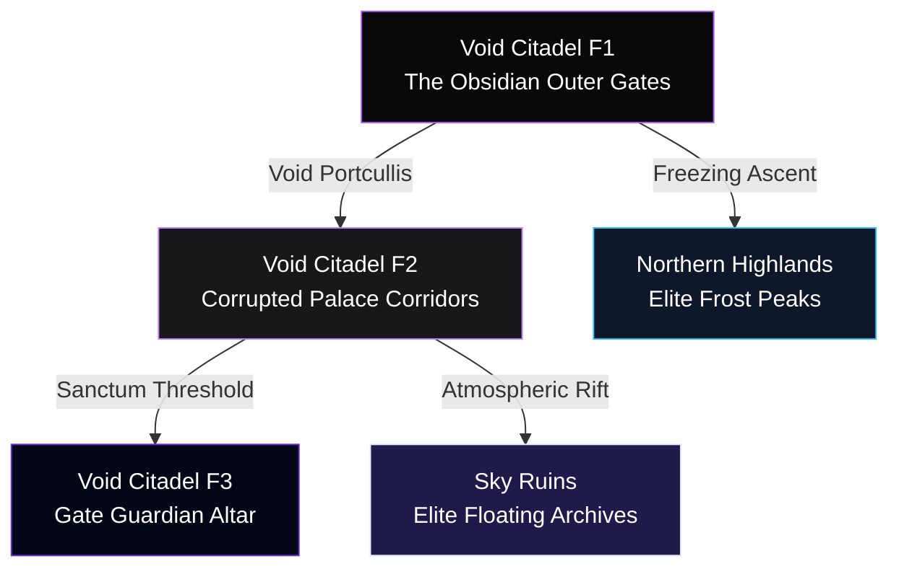

# Concept: Arc 6 — Fortress Gates (Citadel, Highlands, & Sky Ruins)

**Authoritative Lore, Multi-Floor Staging, & Systems Integration Blueprint**  
**Accountability**: The Chronicler (Narrative Lead), Atlas (Worldbuilder), & Vivid (Aesthetic Lead)  
**Status**: Premium Concept Blueprint (Ready for Engine Implementation Pipeline)

---

> [!IMPORTANT]
> **Pipeline Rule Adherence**  
> All mechanics, spatial layouts, dual elite route definitions (**Northern Highlands** & **Sky Ruins**), and encounter arrays defined below serve as the authoritative blueprint prior to native implementation. Direct manual injection of characters into `characters.json` without concept stage completion is strictly forbidden.

---

## 📜 1. Exhaustive Regional Lore Matrix

### The Primordial Baseline: The Archival Spire
Before the rise and collapse of the Five Civilizations, the unknown originators of the **Sky Archive** constructed immense floating infrastructure at the planet's upper atmospheric boundaries. The **Void Anchor Point** was engineered as an ultimate physical safety switch—a high-altitude crystalline network designed to isolate planetary logic arrays from subterranean corruption. 

Someone built these upper corridors to be magnificent: arched halls designed to channel pure sunlight, libraries lined with uncorrupted physical records, and elegant courtyards bridging the stars. It was not a weapon. It was a home.

### Valdris’s Method: The Logic of the Void Warden
When Valdris abandoned his mortal empathy to manage the glitched world engine, he established his seat of power within these floating ruins, corrupting the pristine crystalline spires into the **Void Citadel**. The fortress walls were not quarried; they were grown, fed, and woven from living obsidian that actively consumes light.

Valdris did not garrison his outer walls with enslaved minds. Instead, he employed the logic of **Willful Subjugation**. The **Void Warden** (`void_warden`) was Valdris's final mortal strategist—a man who understood the mathematical certainty of the Shadow Emperor's calculations. He stood at the outer gates for so many centuries that his personal identity dissolved into the architecture. Willing service became irrelevant; he is simply the gate's overarching logic protocol.

### Sourced from the Citadel: Lore of the Consumed Angel
Suspended within the primary courtyard turns the **Consumed Angel** (`consumed_angel`). Sourced directly from our master story archives (`arc_6.json`), this entity represents the tragic zenith of Valdris's descent. It was once a scholar's divine companion—the final created thing Valdris loved before love became computational impossibility for him. Sourced from Lady Essabella's fallen elite, its face has been deleted by void saturation, but its massive wings still remember the geometric shape of grace.

### Sourced from the Peaks: Lore of the Shadow Dragon
The **Northern Highlands** (Elite Expansion Route A) is guarded by the **Shadow Dragon** (`dragon`). Centuries ago, seven elemental dragons anchored the world's thermal equilibrium. Six faded as their corresponding Seals degraded. The seventh survived by actively breathing in raw void energy in place of natural elemental leylines. It is alive, but its biological matrix is deeply mutated. The persistent **Highland Monk** kneels at the freezing summit, praying for the creature at every dawn to keep its void accumulation from reaching absolute critical mass.

### Sourced from the Clouds: Lore of the Four Kings
The **Sky Ruins** (Elite Expansion Route B) predate all five historical civilizations. Valdris placed four of his earliest high-tier victims here as simultaneous throne guardians: **The Pale King** (`lich`), **The Ebon Champion** (`dark_knight`), **The Skeletal Maw** (`bone_dragon`), and **The Storm Sentinel** (`storm_sentinel`). The ruins themselves respond exclusively to elemental acknowledgment. Striking the ancient interface plates with raw force triggers absolute defensive locks.

---

## 🗺️ 2. Multi-Floor Staging System

To enforce our strict geographic progression metrics, the Arc 6 latitude scales across **three primary elevations alongside two independent side-expansion layers**:



### Floor 1: `void_citadel_f1` (The Obsidian Outer Gates)
* **Grid Layout**: `80x40` layout adhering to Vivid's **50/50 Walkable Ground Standard**.
* **Aesthetic Profile (Vivid's Domain)**: Grown black living basalt (`#09090b`) illuminated by jagged violet void-fractures (`#7e22ce`). 
* **Custom Rendering Filter**: `filter: saturate(1.8) contrast(1.25) brightness(0.9) drop-shadow(0 0 10px rgba(126,34,206,0.6));`
* **Mechanics**: **Light-Siphoning Hazard**. Vision radius around party sprites is compressed by $40\%$ unless carrying active `Starlight Vials`. Stepping into complete dark triggers high-speed reactive eidolon ambushes.

### Floor 2: `void_citadel_f2` (Corrupted Palace Corridors)
* **Grid Layout**: `80x40` tragic spatial layout exposing pristine white marble archways cracking under creeping black crystalline veins.
* **Aesthetic Profile**: High-contrast monochrome layout (`#f8fafc` vs `#020617`) layered with muted starlight gradients.
* **Custom Rendering Filter**: `filter: sepia(0.1) hue-rotate(280deg) brightness(1.1);`
* **Mechanics**: Environmental audio siphons project persistent historical dialogue arrays directly onto the canvas layout.

### Floor 3: `void_citadel_f3` (Gate Guardian Altar)
* **Grid Layout**: Compact `40x40` culmination ring.
* **Environment**: Suspended above planetary atmospheric boundaries. Hosts the execution points for the **Consumed Angel** and the overarching **Void Warden** narrative boundary.

---

## 📜 3. Enriched Immersive Quest Pipelines

Regional exploration nodes feed the quest tracking system natively (`data/quests.json`):

### Quest 1: The Seventh Litany
* **Giver**: **Highland Monk** at `Highlands Coordinates (45, 10)`.
* **Rich Dialogue Matrix**:
  * **Start**: *"Tread softly. The snow preserves the sound of ancient breath. The entity circling the peak is the last of the Seven. It swallowed the shadow to keep the mountain from dissolving into air."*
  * **Objective**: Synchronize with $3\times$ `Freezing Altars` at peak dawn intervals to vent the dragon's accumulated void pressure safely.
  * **Resolved**: *"The air registers a clean chill once more. It is alive, but it is no longer purely what it was. I will remain here to offer prayers at every dawn. It feels right that something is still acknowledging its sacrifice."*
* **System Rewards**: Unlocks absolute environmental cold immunity across the upper latitude + grants `1x Dragon Scale Relic`.

### Quest 2: The Aerolith Alignment
* **Giver**: **Spectral Sentinel** at `Sky Ruins Coordinates (12, 35)`.
* **Rich Dialogue Matrix**:
  * **Start**: *"You are not erased. That is more than I can say for most who reach this altitude. These ruins predate everything with a name. The builders recorded events at altitude because elemental interference is minimal here."*
  * **Mechanic Hook**: *"The Storm Sentinel guards the apex. It is not Valdris's creature—it is the ruins' native defense running its final loop. Approach the three `Aerolith Crystals` with elemental resonance, not raw force. The ruins respond to acknowledgment, not assault."*
* **System Rewards**: Instantly aligns floating stone paths to bridge the zero-gravity expanse leading to the **Four Kings** encounter.

---

## ⚔️ 4. Mathematical Boss Encounter Layer

> [!TIP]
> **VVI Source of Truth Integration**  
> All mathematical execution blocks adhere perfectly to the global combat balance models detailed in `claude.md`.

### Tier 1: The Exploration Obstacle — `Consumed Angel`
* **Grid Placement**: Center courtyard layout of `F1 Coordinates (40, 20)`.
* **Identity**: Valdris's ancient unmade companion, stripped of mortal empathy.
* **Explicit Combat Math**: Implements kinetic counter-manipulation logic. Every direct physical or magical assault against the entity adds a flat integer delay to the acting unit's upcoming action priority queue:
$$\text{Action Delay Priority} = \text{Base Delay} \times \left(1.0 + \left(\frac{\text{Angel Speed Factor}}{\text{Target Base Speed}}\right)\right)$$

### Tier 2: The Arc Story Climax — `Void Warden`
* **Grid Placement**: Culmination gateway tile of `F3 Coordinates (20, 20)`.
* **Identity**: Valdris's final strategist, physical host of the **Seal Fragment of the Void**.
* **Cinematic Integration (Wired for Vivid)**: Screen executes a deep crushing violet flash overlay (`#6d28d9`), followed by smooth geometric space-folding animation loops that render the void gates collapsing inward directly over the combat layout canvas.
* **Explicit Combat Math**: Employs an absolute logic-inversion passive matrix. At the end of every complete turn cycle, swaps the current numerical HP percentages of the highest health party member and the lowest health enemy combatant unless absolute disruption variables are applied.

### Tier 3: The Expansion Climax A — `Shadow Dragon`
* **Grid Placement**: Summit node of the `Northern Highlands` route.
* **Explicit Combat Math**: Employs logarithmic Void Saturation breath scaling. Elemental breath output damage scales exponentially with accumulated stack counters:
$$\text{Output Damage} = \text{Base Breath} \times e^{\left(\text{Void Stack Accumulation} \times 0.08\right)}$$

### Tier 4: The Expansion Climax B — `Four Kings`
* **Grid Placement**: Apex platform of the `Sky Ruins` layout.
* **Mechanics**: Four simultaneous bosses operating shared threat arrays. Defeating any single entity redistributes its remaining maximum HP capacity proportionally among the remaining surviving targets.

---

## 💎 5. Premium Relic & Drop System Registry

Defeating these encounter targets registers exclusive items into the runtime client schema:

```json
{
  "relic_void_citadel_core": {
    "name": "Crystalline Siphon of the Citadel",
    "tier": "LEGENDARY",
    "description": "Pristine living obsidian. Doubles the radius of all map light assets and converts 15% of all incoming magical damage into maximum HP barrier stacking.",
    "stat_bonus": { "hp": 300, "def": 30, "res": 30 }
  },
  "relic_dragon_scale_shard": {
    "name": "Frozen Void Scale",
    "tier": "EPIC",
    "description": "Radiates unyielding sub-zero pressure. Elemental skills have a 25% chance to apply absolute space-time freezing to target units for 1 complete turn.",
    "stat_bonus": { "atk": 35, "spd": 15 }
  }
}
```

---

## 🛠️ 6. Implementation Lifecycle Check
1. **Matrix Exporter**: Use **Aethon's** coordinate parser scripts to compile the layout logic strings into literal static arrays (`map-void_citadel_f1.json` through `f3`).
2. **Dialogue Injection**: Register the fully expanded text strings natively inside `data/story/arc_6.json`.
3. **PWA Validation**: Synchronize service worker cache configuration variables to enforce client runtime updates.
