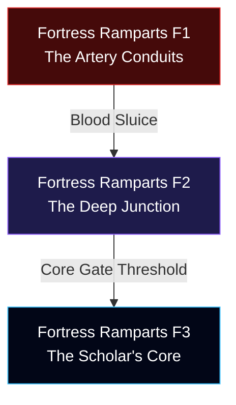

# Concept: Arc 7 — The Inner Sanctum (Fortress Ramparts)

**Authoritative Lore, Multi-Floor Staging, & Systems Integration Blueprint**  
**Accountability**: The Chronicler (Narrative Lead), Atlas (Worldbuilder), & Vivid (Aesthetic Lead)  
**Status**: Premium Concept Blueprint (Ready for Engine Implementation Pipeline)

---

> [!IMPORTANT]
> **Pipeline Rule Adherence**  
> All features, spatial staging coordinates, party splitting logic triggers, and mathematical boss matrices outlined below serve as the authoritative standard prior to engine compilation. Direct modification of `characters.json` or combat maps without concept integration is prohibited.

---

## 📜 1. Exhaustive Regional Lore Matrix

### The Primordial Baseline: The Core Energy Chamber
Deep below the floating spires of the Sky Archive, intersecting the absolute mantle crust of Aethoria, lies the **Core Energy Chamber**. Constructed by primordial engineers as an auxiliary atmospheric pressure valve, this profound space was lined with reflecting white quartz and aligned with ancient mapping mirrors designed to track planetary leylines across thousands of leagues. It was a place of high science and tranquil observation.

### Valdris’s Method: The Calcification of Duty
When Valdris descended upon the final subterranean vaults to secure the core data links, he encountered the ultimate physical barrier: **Maren the Still** and the elite collective known as the **Shadow Keepers**. Recognizing that Valdris's elemental absorption could not be defeated by martial arrays, Maren and his companions executed a collective final directive: they sacrificed their personal biological strings to weave an absolute, immutable barrier around the inner locks.

Valdris did not assault Maren's barrier. He simply allowed the massive, crushing computational residue of seventeen unmade worlds to rest heavily against the perimeter. Over six centuries, the absolute logic of Maren's defense calcified into an automated, host-less structure. Willing defense became irrelevant; the Keepers are now the living stone of the inner sanctum itself—six hundred years of collective refusal given weight and hostility.

### The Tactical Convergence: Lore of the Two Vanguards
Sourced directly from our master story loops (`arc_7.json`), the ascent through the inner ramparts triggers an absolute tactical partition. The deeper passages are not standard halls; they are living biological arteries where the stone pulses with highly saturated memory logic. 

> [!NOTE]
> **The Vanguard Setup**  
> To prevent complete party wipeout from rear-flank void ambushes, the roster splits: **Ria, Valka, Rex, and Drake** spearhead the deep arterial ascent to clear the structural blockage, while **Aya, Tao, Lulu, and Rei** hold the outer portcullis against the Citadel's remaining elite forces. Their physical reunification at the Deep Junction triggers Rei's absolute acknowledgment of Maren's tragic, silent calculus.

### The Ultimate Eulogy: Tao's Resolution
As the party breaches the core chamber threshold, the ambient eidolons project the unadulterated grief of the entire destroyed realm. Sourced from the script runner, Tao delivers the absolute narrative anchor of the expansion:
*"They say they are ready to cross over. Maren, the Forge Lords, the Tide Priests... even the people of Aethelgard. This is the eulogy for a world that has been dying for six hundred years. We are not just fighting to defeat an Emperor. We are fighting to give Aethoria permission to finally rest."*

---

## 🗺️ 2. Multi-Floor Staging System

To enforce our strict geographic progression metrics, the Arc 7 inner latitude scales across **three consecutive descending elevations**:



### Floor 1: `fortress_ramparts_f1` (The Artery Conduits)
* **Grid Layout**: `80x40` linear arterial layout adhering to Vivid's **50/50 Walkable Ground Standard**.
* **Aesthetic Profile (Vivid's Domain)**: Deep pulsing crimson stone (`#450a0a`) shot through with highly toxic black fluid channels (`#09090b`). 
* **Custom Rendering Filter**: `filter: saturate(1.5) contrast(1.3) hue-rotate(-5deg) brightness(0.85);`
* **Mechanics**: **Kinetic Saturation Waves**. Every five turn ticks, the floor tiles discharge a localized static compression field. Moving units must end their turns on specialized uncharged interface plates to prevent turn-skipping lockdowns.

### Floor 2: `fortress_ramparts_f2` (The Deep Junction)
* **Grid Layout**: `80x40` convergence plaza exposing pristine historical quartz pillars cracked by immense vertical stress lines.
* **Aesthetic Profile**: Muted violet starlight gradients layering high-contrast floor arrays.
* **Custom Rendering Filter**: `filter: drop-shadow(0 0 15px rgba(220,38,38,0.4)) contrast(1.1);`
* **Mechanics**: Houses the literal narrative merge points where the divided rosters unite to share current HP thresholds and auxiliary buffs.

### Floor 3: `fortress_ramparts_f3` (The Scholar's Core)
* **Grid Layout**: Compact `40x40` culmination ring.
* **Environment**: The original high-science observation deck. Overarched by complex wall engravings mapping forgotten planetary constellations. Centers on a massive, cracked mapping mirror that acts as the physical threshold to the **Shadow Titan** encounter logic.

---

## 📜 3. Enriched Immersive Quest Pipelines

Regional mapping arrays supply narrative context natively syncing to the echo controller (`data/quests.json`):

### Quest 1: Silenced Names
* **Giver**: Environmental Trigger Plate at `F2 Coordinates (15, 20)`.
* **Rich Dialogue Matrix**:
  * **Start**: *"The interface plate registers an ancient incomplete string: [Maren... Vane... Kael...]. The remainder of the Keepers' registration blocks have been corrupted by static pressure."*
  * **Objective**: Gather $4\times$ `Pristine Quartz Tags` dropped by corrupted vanguard constructs across the arterial passages.
  * **Resolved**: *"You align the tags with the interface stone. The string completes. Their names scroll softly across the internal UI overlay: [Maren the Still, Forgemaster Vane, Sentinel Kael]. They are no longer unrecorded."*
* **System Rewards**: Grants a flat $+10\%$ total HP bonus to all rear-guard units during the final core threshold assault.

### Quest 2: The Sluice Purge
* **Giver**: Vanguard Interface Node at `F1 Coordinates (70, 12)`.
* **Objective**: Eliminate $6\times$ hyper-pressurized `Arterial Slimes` to prevent localized fluid overpressure from flooding the pathing walkways.
* **System Rewards**: Instantly grants `1x Elixir of the Core` + unlocks shortcut coordinates bypassing standard movement logic arrays.

---

## ⚔️ 4. Mathematical Boss Encounter Layer

> [!TIP]
> **VVI Source of Truth Integration**  
> All programmed encounter behavior directly mirrors the advanced mathematical scaling profiles enforced by `claude.md`.

### Tier 1: The Exploration Obstacle — `Void Colossus`
* **Grid Placement**: Solid physical blockage guarding the gate threshold of `F2 Coordinates (40, 10)`.
* **Identity**: Crystallized ambient data residue accumulated over six centuries of imperial siphoning.
* **Explicit Combat Math**: Employs Dynamic Data Armor reinforcement logic. Damage mitigation scales proportionally to the sum total of active stat enhancements present across the player party:
$$\text{Damage Reduction Factor} = 0.20 + \left(0.15 \times \text{Active Party Buff Stacks}\right)$$
* **Counter Strategy**: Stripping friendly buffs via support disruption neutralizes the scaling multiplier entirely.

### Tier 2: The Arc Story Climax — `Shadow Titan`
* **Grid Placement**: Center interface mirror of `F3 Coordinates (20, 20)`.
* **Identity**: Maren the Still and all merged Shadow Keepers, transformed into living shadow-stone.
* **Cinematic Integration (Wired for Vivid)**: Screen triggers absolute color saturation drain (`filter: grayscale(1)`), pierced solely by deep glowing red boundary fractures (`#dc2626`) that map the massive, calcified stone-shield configurations directly over the battle field viewport.
* **Explicit Combat Math**: Implements a highly volatile Cubic Willpower Scaling logic. Physical and magical output damage scales up dramatically as its physical integrity drops toward critical levels:
$$\text{Output Multiplier} = 1.0 + \left(1.5 \times \left(1.0 - \frac{\text{Current HP}}{\text{Max HP}}\right)^3\right)$$
* **Mechanics**: Reaching $0\%$ HP triggers a withdrawal state, dissolving the stone form into cold mist that recedes directly into the final inner engine core.

---

## 💎 5. Premium Relic & Drop System Registry

Defeating these apex constructs injects bespoke, game-changing inventory nodes into the player's runtime dictionary:

```json
{
  "relic_maren_stone": {
    "name": "Calcified Heart of the Still",
    "tier": "LEGENDARY",
    "description": "Dense, unyielding quartz fragment. Vanguard units gain absolute immunity to knockback/timeline manipulation mechanics and reflect 20% of received direct damage back to the attacker.",
    "stat_bonus": { "def": 40, "res": 40, "hp": 400 }
  },
  "relic_core_mirror_shard": {
    "name": "Splinter of the Sky Mirror",
    "tier": "EPIC",
    "description": "Ancient polished tracking glass. Grants all support units a 15% passive chance to completely copy any single-target buff cast by an enemy unit.",
    "stat_bonus": { "spd": 22, "mp": 150 }
  }
}
```

---

## 🛠️ 6. Implementation Lifecycle Check
1. **Grid Compilation**: Parse the floor structural geometry arrays into literal static arrays (`map-fortress_ramparts_f1.json` through `f3`).
2. **Text Serialization**: Inject the finalized vanguard text partition loops natively inside `data/story/arc_7.json`.
3. **PWA Validation**: Update service worker asset lists to ensure prompt deployment synchronization across active runtime builds.
