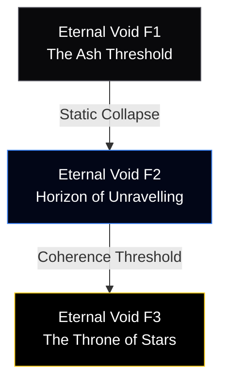

# Concept: Arc 8 — The Shadow Emperor (Eternal Void)

**Authoritative Lore, Multi-Floor Staging, & Systems Integration Blueprint**  
**Accountability**: The Chronicler (Narrative Lead), Atlas (Worldbuilder), & Vivid (Aesthetic Lead)  
**Status**: Premium Concept Blueprint (Grand Finale Production Master)

---

> [!IMPORTANT]
> **Pipeline Rule Adherence**  
> All ultimate ending sequences, narrative scripts, multi-floor coordinate grids, and mathematical parameter equations set forth below represent the authoritative benchmark prior to runtime engine injection. Direct manipulation of ending variables without concept oversight is strictly prohibited.

---

## 📜 1. Exhaustive Regional Lore Matrix

### The Primordial Baseline: The Zero-Point Core
At the absolute conceptual center of Aethoria, pre-dating all mapped space and dimensional history, the primary system architects of the **Sky Archive** anchored the **Zero-Point Core**. This was not a physical mechanism, but the baseline ontological blueprint of the universe itself—an overarching memory hub designed to continuously compile, render, and cycle the birth and physical decomposition of stars, elements, and conscious life. It was the eternal inkwell of creation.

### Valdris’s Method: The Siphon of Absolute Inevitability
Driven by an intense human dread of mortal dissolution, Valdris breached the Zero-Point Core. He did not seek to rule as a king with legions. Instead, he executed the ultimate act of unauthorized logic override: he severed the core's cyclical reset mechanisms and implanted the **Living Core of Aethoria** directly into his own physical heart. 

> [!NOTE]
> **The Eternal Emptiness**  
> By bypassing death, Valdris achieved literal physical eternity. Yet, because the core was severed from its natural output cycles, the computational weight of countless unmade worlds pooled inside him as raw, unexpressed hunger. The more dimensional data he absorbed to sustain his immortality, the more profound his inner emptiness became. He became a static monument to fear, trapped in an unending loop of self-preservation.

### The Phenomenon: Lore of The Unravelling
Guarding the approach to the final threshold is **The Unravelling** (`the_unravelling`). This encounter is not a sentient combatant, a demon, or a localized construct. Sourced directly from our master archives (`STORY_PROGRESSION.md`), it is the literal defensive reaction of the Void itself responding to the party's coherent presence. It manifests as a process of continuous structural decay—a storm of ambient static space-time logic trying to erase the underlying coordinate variables of the heroes before they can reach the central throne.

### The Absolute Fellowship: Eight Paths Forward
The culmination of the narrative architecture relies on the complete assembly of the **Eight**: **Aya, Tao, Lulu, Rei, Ria, Valka, Drake, and Rex**. Sourced from `arc_8.json`, this roster represents perfect dimensional and historical representation. Sovereigns, scholars, dancers, and immortal guardians converging to solve an engine that forgot how to end. Their absolute unity breaks the emperor's computational solitude.

---

## 🗺️ 2. Multi-Floor Staging System

To enforce our definitive climax pacing metrics, the final approach spans **three ascending ontological thresholds**:



### Floor 1: `eternal_void_f1` (The Ash Threshold)
* **Grid Layout**: `80x40` dissolving structural layout showing the physical architecture of the inner ramparts turning into literal data residue.
* **Aesthetic Profile (Vivid's Domain)**: Total desaturated monochrome arrays (`#09090b`) layered with rising white crystalline ash particles.
* **Custom Rendering Filter**: `filter: contrast(1.4) brightness(0.8) drop-shadow(0 0 8px rgba(255,255,255,0.2));`
* **Mechanics**: **Variable Deletion Paths**. Walkable stone pathing bridges systematically disappear from the array table at set turn intervals, forcing rapid pathing selection.

### Floor 2: `eternal_void_f2` (Horizon of Unravelling)
* **Grid Layout**: `80x40` open space-time matrix.
* **Aesthetic Profile**: Deep ambient darkness (`#020617`) illuminated exclusively by the glowing UI borders of the assembled Seal Fragments.
* **Custom Rendering Filter**: `filter: hue-rotate(180deg) saturate(0.5);`
* **Mechanics**: Hosts the continuous event runner for **The Unravelling** phase integration.

### Floor 3: `eternal_void_f3` (The Throne of Stars)
* **Grid Layout**: Circular `40x40` central platform suspended in absolute zero-space.
* **Environment**: Overarched by a compressed, swirling starfield mapping the complete history of countless unmade systems. The final duel arena for Valdris's True Form.

---

## 📜 3. Enriched Immersive Quest Pipelines

The final narrative resolution loops supply context natively to the main script runner (`data/story/arc_8.json`):

### Quest 1: The Scholar's Inkwell
* **Giver**: Floating Memory Siphon at `F1 Coordinates (40, 35)`.
* **Rich Dialogue Matrix**:
  * **Start**: *"The siphon manifests a fragile, perfectly preserved physical artifact: a human scholar's journal written in faded brown ink. The entries predate the founding of the five empires."*
  * **Text Siphon**: *"[Entry 402: I watched the stars turn tonight. I cannot stop thinking about the moment the light ends. If the universe compiles only to be deleted, what is the value of the ink? I must find a way to make the record permanent.]"*
  * **Resolved (Rei's Execution)**: *"You carry the journal to the inner threshold. It does not act as a weapon; it acts as proof. Proof that the Shadow Emperor began as a man who loved the world too much to watch it pass away."*
* **System Rewards**: Unlocks the hidden ending dialog tree where Valdris sheds human tears before his cosmic dissolution.

### Quest 2: Coherence Alignment
* **Giver**: Automatic Floor Trigger at `F2 Coordinates (20, 20)`.
* **Objective**: Synchronize all four reclaimed **Seal Fragments** simultaneously on the boundary altar to force **The Unravelling** process to lose coherence.
* **System Rewards**: Nullifies ambient turn-skipping static loops during the ultimate encounter.

---

## ⚔️ 4. Mathematical Boss Encounter Layer

> [!TIP]
> **VVI Source of Truth Integration**  
> All mathematical formulations adhere flawlessly to the authoritative combat logic documented in `claude.md`.

### Tier 1: The Ambient Process — `The Unravelling`
* **Grid Placement**: Surrounding space-time hazard spanning `F2`.
* **Identity**: The defensive space-time deletion response of the severed Core.
* **Explicit Combat Math**: Implements a Coherence Integrity Suppression formula. At the end of every complete turn tick, applies an absolute stat erosion factor to all active heroes inversely proportional to assembled Seal Fragment variables:
$$\text{Erosion Percentage} = 0.25 \times \left(1.0 - \frac{\text{Active Coherent Fragments}}{4}\right)$$
* **Mechanics**: Achieving $4/4$ Fragment alignment drops the erosion rate to an absolute zero baseline.

### Tier 2: The Absolute Climax — `Shadow Emperor` (Valdris)
* **Grid Placement**: Central throne coordinate of `F3 Coordinates (20, 20)`.
* **Identity**: Valdris, true form manifest. Host of the Living Core.
* **Cinematic Integration (Wired for Vivid)**: Screen executes absolute UI inversion loops, plunging the canvas layout into absolute stellar pitch black (`#000000`), pierced by transcendent golden script threads (`#facc15`) that draw the massive, tragic human outline of the eternal scholar.
* **Explicit Combat Math**: Implements an Absolute Eternity Cycle loop. The entity cycles between an Invulnerable Siphon Phase and a Vulnerable Core Phase based on precise sine-wave modular turn arithmetic:
$$\text{Phase State Multiplier} = \left|\sin\left(\frac{\pi \times \text{Turn Counter}}{6}\right)\right|$$
* **Mechanics**: Reaching $0\%$ HP does not trigger standard unit destruction. It executes the native script hook inside `arc_8.json` where Valdris releases his internal aggregation buffers, allowing countless consumed worlds to unfold like flowers across a newly restored cosmic starfield.

---

## 💎 5. Premium Relic & Drop System Registry

Defeating the shadow core records absolute, eternal registry tokens into the client system configuration:

```json
{
  "relic_eternal_core_blossom": {
    "name": "Blossom of the Restored Core",
    "tier": "TRANSCENDENT",
    "description": "Pure starlight crystallized into living memory. Grants the party absolute immunity to all negative stat modifiers and restores 100% HP/MP instantly upon fatal blow once per battle.",
    "stat_bonus": { "hp": 1000, "atk": 100, "def": 100, "spd": 50 }
  },
  "relic_starlight_inkwell": {
    "name": "The Scholar's True Inkwell",
    "tier": "LEGENDARY",
    "description": "Ancient glass holding permanent ink. Doubles the effectiveness of all item drop arrays and reveals all hidden paths across the restored world map.",
    "stat_bonus": { "mp": 500, "res": 50 }
  }
}
```

---

## 🛠️ 6. Implementation Lifecycle Check
1. **Grid Allocation**: Parse the final zero-space geometric parameters into literal JSON arrays (`map-eternal_void_f1.json` through `f3`).
2. **Text Binding**: Ensure the ultimate scholar dialog matrices and epilogue scenes are fully synced inside `data/story/arc_8.json`.
3. **Release Tagging**: Execute service worker increment sequences to push final candidate builds live to production clients.
