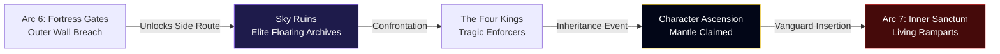

# Concept: Character Ascension Event Pipeline

**Authoritative Timeline Integration, Mechanics Override, & Systems Blueprint**  
**Accountability**: The Chronicler (Narrative Lead), Atlas (Worldbuilder), & Vivid (Aesthetic Lead)  
**Status**: Premium Standalone Blueprint (Bridging Arc 6 and Arc 7)

---

> [!IMPORTANT]
> **Global AI Protocol Check: Zero Index Allocation**  
> In strict compliance with the mandate **Never add new characters in characters.json**, Character Ascension does not generate novel database roster entries. Instead, it executes an instantaneous client-side variable injection mapping directly to active memory instances using the `SpriteRenderer` suffix syntax (`[character_id]_ascendant`), preserving base state indexing arrays.

---

## ⏱️ 1. Definitive Story Timeline Integration

### The Arc 6 / Arc 7 Intermission Milestone
Character Ascension is not an arbitrary leveling trigger; it represents the absolute **ontological transition** required to survive the dense living blood-arteries of the inner fortress ring. 

1. **The Outer Gate Completion**: In **Arc 6**, the party breaches the living obsidian gates of the Void Citadel, simultaneously revealing the ancient coordinates to the **Sky Ruins** (Level Range 30 – 38).
2. **The Intermission Plunge**: Rather than pushing forward immediately into the highly saturated despair metrics of the inner fortress ring, the party scales the atmosphere to free the **Four Kings**.
3. **The Inheritance Transformation**: By defeating these fallen lieutenants and purging their void corruption, the pure original heroic wills remain. Our four baseline characters step forward onto the central ruin platform to absorb these ancient mantles, upgrading their graphical frames, parameter metrics, and specialized command logic arrays.
4. **The Arc 7 Vanguard Insertion**: Fully Ascended, the party enters **Arc 7 (Inner Sanctum)** with sufficient localized resonance density to withstand the calcified willpower fields of Maren the Still.

---

## 💎 2. Exhaustive Fourfold Ascension Matrix

### 1. Tao $\longrightarrow$ Lunar Deathspeaker
* **Inherited Will**: **The Pale King** (High Magister Kaelen).
* **Narrative Integration**: Tao accepts Kaelen's pristine, cold logical spirit strings while retaining her deep emotional empathy for the dead. She bridges high computational theory with human grief.
* **Aesthetic Transformation (Vivid's Domain)**: Pure white robes shot through with deep glowing crimson boundary markers. 
* **Custom Rendering Filter**: `filter: hue-rotate(320deg) brightness(1.2) drop-shadow(0 0 10px rgba(225,29,72,0.6));`
* **Signature Art Override**: Grants access to `Sovereign Eclipse`. Replaces single-target healing strings with an ultimate party-wide life siphon drawing directly from target boss HP barriers.

### 2. Rei $\longrightarrow$ Ebon Warden
* **Inherited Will**: **The Ebon Champion** (General Vane).
* **Narrative Integration**: Rei shatters Vane's puppeteered black plate. Because of Rei's immense two-thousand-year karmic weight, he is capable of purifying and donning the empty shell without surrendering internal pathing logic.
* **Aesthetic Transformation**: Deep polished obsidian plating highlighted by rich pulsing crimson visor threads.
* **Custom Rendering Filter**: `filter: saturate(1.2) contrast(1.25) drop-shadow(0 0 12px rgba(153,27,27,0.8));`
* **Signature Art Override**: Unlocks `Karmic Reprisal`. Base defensive stances automatically execute kinetic counter-strikes returning flat physical integer values to the attacking unit.

### 3. Drake $\longrightarrow$ Wyrmfall Knight
* **Inherited Will**: **The Skeletal Maw** (Vermithrax).
* **Narrative Integration**: Drake frees the mutated half-dragon skeleton, absorbing the pure original purple crystalline dragoon mantle of the First Dragoon.
* **Aesthetic Transformation**: Sleek violet crystalline dragon scales encasing heavy jump greaves.
* **Custom Rendering Filter**: `filter: hue-rotate(260deg) saturate(1.4) drop-shadow(0 0 15px rgba(139,92,246,0.7));`
* **Signature Art Override**: Upgrades standard vertical actions into `Apex Heavensplitter`, complete with landing area impact damage models that strip target unit defense buffs.

### 4. Aya $\longrightarrow$ Storm-Rime Sovereign
* **Inherited Will**: **The Storm Sentinel** (Bound Master Architect).
* **Narrative Integration**: Aya calms the violent weather network grid, accepting the raw uncorrupted atmospheric processing codes into her personal cryo arrays.
* **Aesthetic Transformation**: Deep electric azure robes lined with crackling sub-zero plasma arcs.
* **Custom Rendering Filter**: `filter: brightness(1.15) drop-shadow(0 0 18px rgba(56,189,248,0.9));`
* **Signature Art Override**: Basic ice invocations execute localized secondary lightning cascades complete with absolute timeline freezing hooks.

---

## 🧮 3. Explicit Parameter Multiplication Equations

Upon triggering the Ascension Event sequence inside the script engine runner, unit statistical vectors undergo an absolute baseline parameter recalculation:

$$\text{Ascended Base Metric} = \left(\text{Original Level Base} \times 1.35\right) + \text{Flat Tier Offset}$$

Where the **Flat Tier Offset** applies standard archetype specialization vectors:
* **Lunar Deathspeaker**: $+250\text{ MP}, +35\text{ Res}$
* **Ebon Warden**: $+450\text{ HP}, +40\text{ Def}$
* **Wyrmfall Knight**: $+50\text{ Atk}, +20\text{ Spd}$
* **Storm-Rime Sovereign**: $+45\text{ Magic Output}, +25\text{ Spd}$

---

## 🛠️ 4. Implementation Lifecycle Check
1. **Registry Hook**: Inject the event hook `checkAscensionEligibility()` directly into the final victory callbacks of the Four Kings encounter scripts.
2. **CSS Token Verification**: Hardcode the new styling filters into `BattleUI.ASCENSION_FILTERS` mapping to character ID keys.
3. **PWA Validation**: Synchronize runtime service worker signatures to enforce prompt local caching updates for newly bound dynamic graphic textures.
