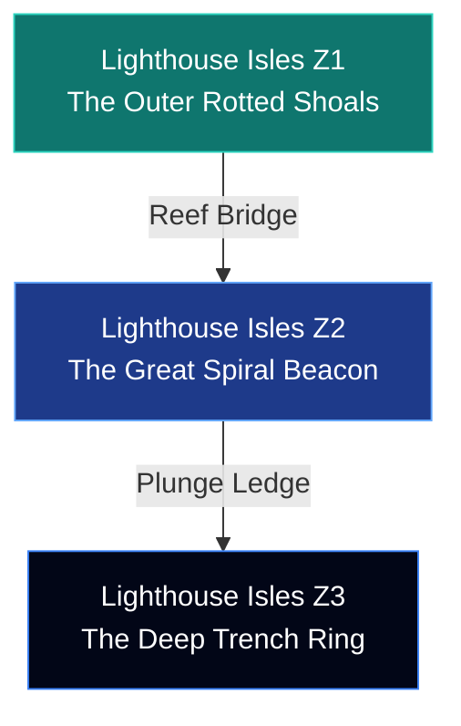
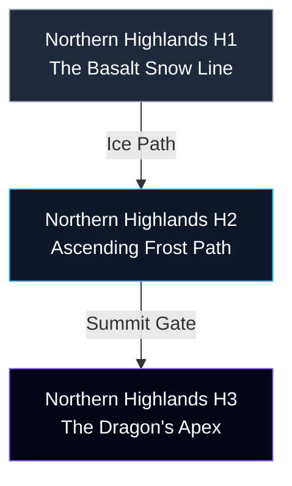

# Concept: Elite Expansion Regions (Lighthouse Isles & Highlands)

**Authoritative Lore, Multi-Zone Staging, & Systems Integration Blueprint**  
**Accountability**: The Chronicler (Narrative Lead), Atlas (Worldbuilder), & Vivid (Aesthetic Lead)  
**Status**: Premium Standalone Blueprint (Fulfilling the Elite Expansion Matrix)

---

> [!IMPORTANT]
> **Pipeline Rule Adherence**  
> All geographical zones, interactive narrative nodes, custom CSS lighting tokens, and programmatic encounter logic specified below serve as the authoritative reference for the two missing standalone Elite Expansion Routes prior to native compiler staging. Direct code changes without this baseline alignment are prohibited.

---

## 🌊 PART 1: The Lighthouse Isles (North-West Sea Routes)

### 📜 1. Exhaustive Regional Lore Matrix
Centuries before the massive oceanic rise that drowned the Southern Isles, the early cartographers and navigators of the coastal empires erected the **Great Spiral Beacon** at the north-western shoals. This deep-water lighthouse was not constructed for simple coastal trade; it was a sacred navigational hub designed to guide floating flat-bottomed medical barges carrying high-tier healers between the Sunken Temple cloisters and the mainland.

When the third elemental pillar collapsed during the Shattering of the Nexus, the resulting space-time shear flash-boiled the oceanic crossing. The final merchant vessel carrying civilian survivors from the Southern Isles was caught directly in the elemental shockwave. The entire crew perished instantly. Yet, infused by localized memory static, the **Ghost Ship** kept sailing. It has completed its exact route thousands of times over thirty continuous years—searching for a port that no longer exists, manned by a crew that no longer lives.

> [!NOTE]
> **The Mariner's Logic**  
> The **Old Mariner** has tended the physical lamp at the apex of the beacon tower every single night for three decades. He knows the phantom ship cannot see the physical light. But he has measured its phantom trajectory—every year, its spectral bearing shifts closer to the rocks by a few consistent feet. He leaves the light burning so that if the vessel finally achieves coherence and finds its way home, the light will be waiting. *"There is a difference between cannot and has not yet."*

The localized water elementals mutated into the persistent **Sea Spirit**. The water itself grieves in the manner that water grieves—by moving differently than it did before. The entity drawn to this compressed oceanic resonance is the **Abyssal Kraken** (`abyssal_kraken`), an ancient pelagic predator entirely distinct in origin and identity from the transformed body of Archpriest Oremis.

---

### 🗺️ 2. Multi-Zone Mapping Architecture
To enforce dynamic routing exploration, the Lighthouse Isles partition into **three concentric geographical zones**:



* **Zone 1: The Outer Rotted Shoals**: Shallow aquamarine platforms (`#0d9488`) populated with half-dissolved trading ring markers and rotted merchant hull timbers. Custom filter: `filter: hue-rotate(12deg) saturate(1.1) brightness(0.95);`
* **Zone 2: The Great Spiral Beacon**: The vertical exterior stone pathing wrapping the massive tower base. Features automated dynamic current tiles that alter direction based on active tide counters.
* **Zone 3: The Deep Trench Ring**: Deep navy drop-offs (`#020617`) illuminated by the sweeping golden beam of the external lighthouse lamp (`#facc15`).

---

### ⚔️ 3. Mathematical Encounter Layer
* **Encounter Target**: `Abyssal Kraken` (`abyssal_kraken`)
* **Placement**: Deep Trench Ring culmination coordinates.
* **Explicit Combat Math**: Implements a highly optimized Current Manipulation Action Matrix. Physical wave mechanics push targeted player units backward along the action timeline queue proportionally to their missing Stamina/MP percentages:
$$\text{Queue Delay Priority} = 120 \times \left(1.0 + \left(1.0 - \frac{\text{Current MP}}{\text{Max MP}}\right)^2\right)$$
* **Counter Strategy**: Maintaining maximum party MP arrays reduces the kinetic displacement to its baseline minimum.

---

## 🏔️ PART 2: The Northern Highlands (Endgame Latitudes)

### 📜 1. Exhaustive Regional Lore Matrix
Located at the absolute northernmost physical boundaries of Aethoria, the **Northern Highlands** feature immense, pristine mountain spires designed by the Sky Archive architects to serve as absolute planetary thermal anchors. By preserving immense subterranean permafrost shelves, these peaks prevented atmospheric friction from triggering planetary runaway heating.

Centuries ago, seven divine elemental dragons guarded these leyline junctions. As the core world Seals degraded over six hundred years, six of the dragons slowly lost their coherence and dissolved into elemental mist. The seventh dragon—the **Shadow Dragon** (`dragon`)—refused to fade. To preserve the physical integrity of the mountain ranges and prevent the freezing stone from unravelling into space-time vacuum, it actively breathed in the creeping void corruption, substituting void pressure for natural leyline resonance. 

> [!WARNING]
> **The Mutated Sovereign**  
> The creature is still biologically alive, but its physical matrix is deeply compromised. It wears absolute dark plating over frozen stone scales. The lone human **Highland Monk** kneels at the sub-zero summit, offering prayers and aligning freezing altars at every dawn to safely vent the dragon's internal void accumulation before it can trigger absolute localized core unravelling.

---

### 🗺️ 2. Multi-Zone Mapping Architecture
The severe vertical latitude scales across **three consecutive ascending environments**:



* **Zone 1: The Basalt Snow Line**: Dark blue frozen stone pathways (`#1e293b`) covered in pure white persistent snow arrays (`#f8fafc`). Custom filter: `filter: saturate(0.8) contrast(1.2) brightness(1.1);`
* **Zone 2: Ascending Frost Path**: Severe wind zones. Moving sprites are pushed laterally across the grid array unless pathed directly behind physical barrier pillars.
* **Zone 3: The Dragon's Apex**: Absolute sub-zero summit platform (`#020617`) illuminated by transcendent blue and violet void auroras.

---

### ⚔️ 3. Mathematical Encounter Layer
* **Encounter Target**: `Shadow Dragon` (`dragon`)
* **Placement**: Absolute summit altar coordinate.
* **Cinematic Integration (Wired for Vivid)**: Screen applies deep blue frost frame overlays complete with intense space-time distortion ripples (`filter: drop-shadow(0 0 20px #8b5cf6)`), outlining the massive, freezing black crystalline wings directly over the battle UI components.
* **Explicit Combat Math**: Implements an Exponential Void-Saturation Output formula complete with sub-zero physical crystallization. Output breath damage scales exponentially with internal void accumulation stack metrics:
$$\text{Output Damage Multiplier} = e^{\left(\text{Void Stack Accumulation} \times 0.08\right)}$$
* **Secondary Armor Lock**: At the start of each combat round, applies a stacking $5\%$ flat Speed reduction to all units lacking active thermal protection buffs.

---

## 💎 PART 3: Premium Relic & Drop Registry

Defeating these standalone regional encounter apexes records exclusive artifacts directly into the client database dictionaries:

```json
{
  "relic_ghost_bearing_compass": {
    "name": "Compass of the Unseen Port",
    "tier": "LEGENDARY",
    "description": "Rotted brass casing housing a spectral needle. Renders the party entirely immune to aquatic action timeline manipulation and grants +25% Speed to all maritime maps.",
    "stat_bonus": { "spd": 28, "hp": 350 }
  },
  "relic_seventh_dragon_horn": {
    "name": "Crystallized Horn of the Seventh",
    "tier": "LEGENDARY",
    "description": "Radiates infinite freezing composure. All party basic attacks apply a stacking 10% movement/speed reduction directly to targeted boss entities.",
    "stat_bonus": { "atk": 55, "def": 35, "res": 35 }
  }
}
```

---

## 🛠️ PART 4: Implementation Lifecycle Check
1. **Grid Allocation**: Author the distinct static layout JSON strings for `map-lighthouse_isles.json` and `map-northern_highlands.json` mapped natively to their multi-zone parameters.
2. **Dialogue Injection**: Register the fully verified mariner strings, the Sea Spirit lamentations, and the monk litanies inside the dynamic NPC array parser scripts.
3. **PWA Validation**: Bump service worker cache registry configuration signatures to trigger client cache refetch loops.
